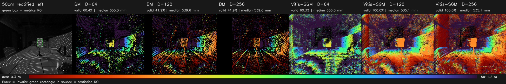
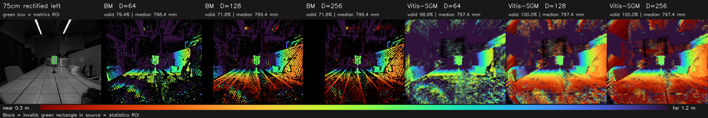
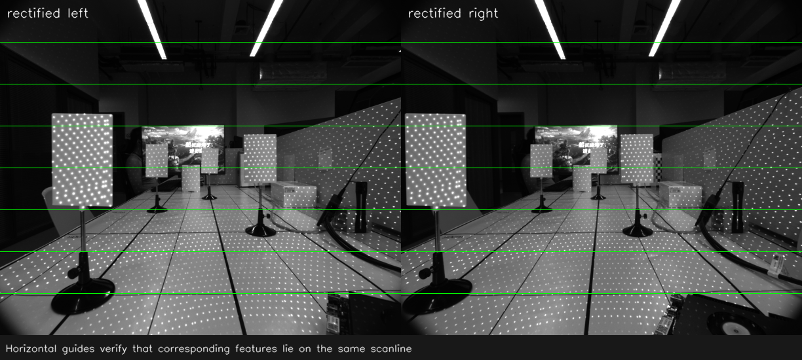
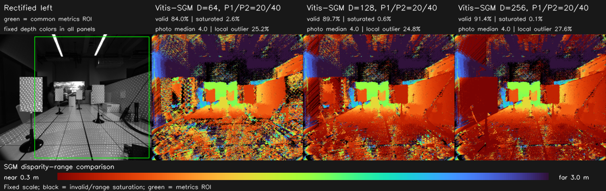
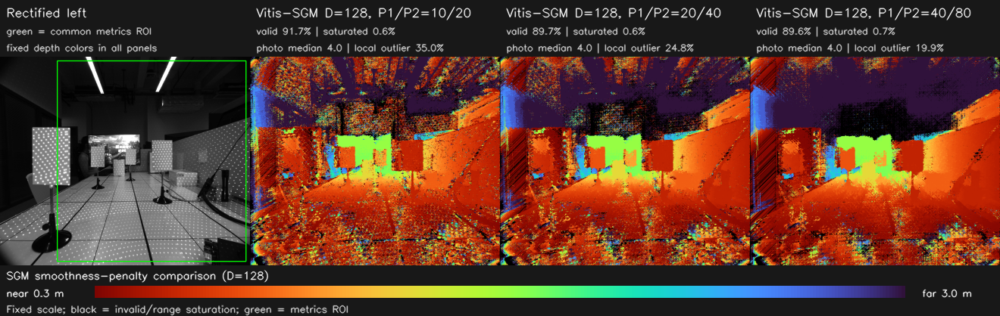
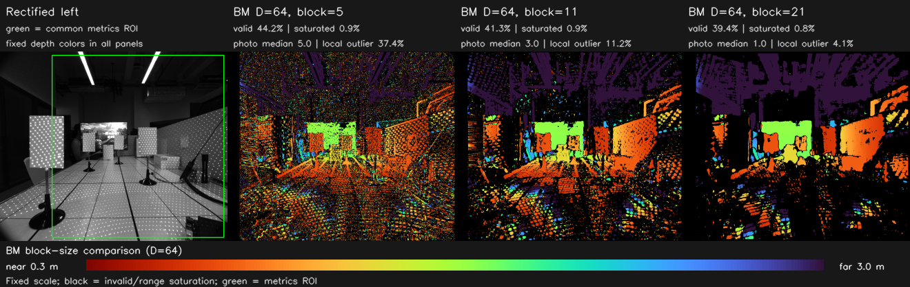
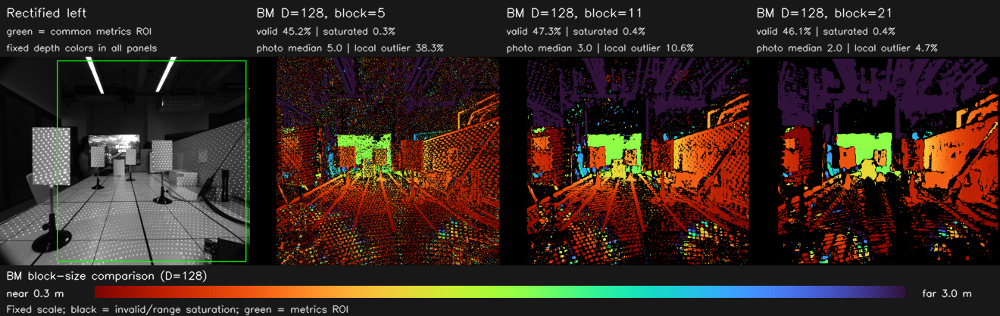
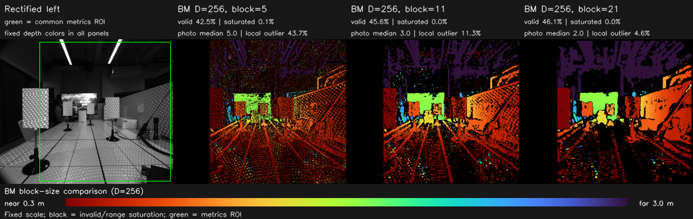

# Vitis Stereo CPU Version

这是从 `Vitis_Libraries/vision` 的立体匹配示例中独立出来的纯 CPU
测试工程。工程只依赖普通 C++17 和 OpenCV，不依赖 Vitis、HLS、
`ap_int`、OpenCL/XRT 或 FPGA bitstream。

## 目录

- [1. 原目录里是不是有 BM 和 SGBM 两套算法？](#chapter-1)
- [2. 本工程内容](#chapter-2)
- [3. 编译](#chapter-3)
- [4. 运行](#chapter-4)
- [5. 输出说明](#chapter-5)
- [6. 自研相机 50 cm / 75 cm 深度实验](#chapter-6)
  - [6.1 横向效果对比](#chapter-6-1)
    - [6.1.1 50 cm](#chapter-6-1-1)
    - [6.1.2 75 cm](#chapter-6-1-2)
  - [6.2 定量结果](#chapter-6-2)
    - [6.2.1 50 cm 目标板](#chapter-6-2-1)
    - [6.2.2 75 cm 目标板](#chapter-6-2-2)
  - [6.3 建议参数](#chapter-6-3)
    - [6.3.1 同时覆盖 50 cm 和 75 cm](#chapter-6-3-1)
    - [6.3.2 只处理约 75 cm 且场景中没有更近物体](#chapter-6-3-2)
  - [6.4 公制深度偏差说明](#chapter-6-4)
  - [6.5 复现实验](#chapter-6-5)
- [7. 0724 多距离室内场景参数验证](#chapter-7)
  - [7.1 数据、左右顺序与校正检查](#chapter-7-1)
  - [7.2 评价口径](#chapter-7-2)
  - [7.3 Vitis-SGM 视差范围对比](#chapter-7-3)
  - [7.4 Vitis-SGM 平滑惩罚对比](#chapter-7-4)
  - [7.5 StereoBM 块大小对比](#chapter-7-5)
  - [7.6 参数建议与结论](#chapter-7-6)
  - [7.7 复现实验](#chapter-7-7)

<a id="chapter-1"></a>

## 1. 原目录里是不是有 BM 和 SGBM 两套算法？

是。两套核心算法及原始入口如下：

| 路线 | Vitis 目录/接口 | 算法含义 | 原 CPU 参考代码 |
|---|---|---|---|
| BM | `L1/examples/stereolbm` / `xf::cv::StereoBM` | Local Block Matching，局部 SAD 块匹配 | `xf_stereolbm_tb.cpp` 中的 OpenCV `cv::StereoBM` |
| SGBM | `L1/examples/sgbm` / `xf::cv::SemiGlobalBM` | Census 代价 + 半全局路径聚合 | `xf_sgbm_tb.cpp` 中的标量 `compute_SGM` |

需要注意：Vitis 目录名是 `sgbm`，硬件函数名是 `SemiGlobalBM`，但 CPU
参考函数叫 `compute_SGM`。这里的 SGBM CPU 程序是从 Vitis 测试台提取的
自带参考实现，并不是 OpenCV 的 `cv::StereoSGBM`。

`L1` 和 `L2` 中也各有一份示例。算法并没有因此变成四套：L1 是 HLS/C
仿真入口，L2 增加了 OpenCL/XRT 主机调用；两层中的 CPU 参考计算基本相同。

<a id="chapter-2"></a>

## 2. 本工程内容

- `vitis_bm_cpu`：OpenCV `StereoBM` CPU 参考程序。
- `vitis_sgbm_cpu`：Vitis 的 Census + 4 路径 SGM 标量 CPU 参考程序。
- `run_cpu_tests.sh`：配置、编译并依次运行两套算法。

默认参数保持原 Vitis 示例配置：

| 参数 | BM | SGBM/SGM |
|---|---:|---:|
| 视差数 | 32 | 64 |
| 窗口 | 11×11 SAD | 5×5 Census |
| 小/大惩罚 P1/P2 | — | 20 / 40 |
| 聚合路径数 | — | 4 |
| BM 唯一性比例 | 15 | — |
| BM 纹理阈值 | 20 | — |
| BM 预滤波上限 | 31 | — |

<a id="chapter-3"></a>

## 3. 编译

当前机器已有的 OpenCV 可以这样使用：

```bash
cd /home/hcc/Desktop/HXB/Vitis_Stereo_CPU_Ver
/usr/bin/cmake -S . -B build \
  -DCMAKE_BUILD_TYPE=Release \
  -DOpenCV_DIR=/home/hcc/Desktop/HXB/opencv-install-min/lib/cmake/opencv4
/usr/bin/cmake --build build --parallel
```

如果系统安装的 OpenCV 自带 `OpenCVConfig.cmake` 且 CMake 能自动找到，
可以不传 `OpenCV_DIR`。

<a id="chapter-4"></a>

## 4. 运行

一次运行 BM 和 SGBM：

```bash
./run_cpu_tests.sh LEFT.png RIGHT.png
```

结果默认写入 `output/`。当前 Vitis 仓库自带图像的完整命令是：

```bash
./run_cpu_tests.sh \
  /home/hcc/Desktop/HXB/Vitis_Libraries/vision/data/left.png \
  /home/hcc/Desktop/HXB/Vitis_Libraries/vision/data/right.png
```

也可以分别运行：

```bash
./build/vitis_bm_cpu LEFT.png RIGHT.png bm_visual.png
./build/vitis_sgbm_cpu LEFT.png RIGHT.png sgbm_raw.png
```

可选覆盖视差数和 BM 窗口：

```bash
./build/vitis_bm_cpu LEFT.png RIGHT.png bm_visual.png 64 15
./build/vitis_sgbm_cpu LEFT.png RIGHT.png sgbm_raw.png 32
```

Vitis-SGM 还可以在视差数后覆盖 `P1/P2`；省略时仍使用 Vitis 示例默认值
`20/40`：

```bash
./build/vitis_sgbm_cpu LEFT.png RIGHT.png sgbm_raw.png 128 40 80
```

BM 的视差数必须是 16 的倍数。两套程序都要求输入为相同尺寸的左右校正图；
读取时会强制转换为单通道灰度图。

<a id="chapter-5"></a>

## 5. 输出说明

- BM 输出是按 Vitis 测试台方式缩放到 8 位的可视化图。
- SGBM 的指定输出文件保存原始整数视差（默认范围 0–63），同时自动生成
  同目录、文件名带 `_visual` 后缀的 0–255 拉伸图。

原 SGBM 测试台会同时保留每条路径的完整三维代价体。独立版本保持完全相同
的 Census 代价、四个方向、递推公式和最小代价选取规则，但复用单个路径代价
缓存，并把每像素重复扫描视差最小值的实现改为等价的一次扫描。以
1280×720、64 视差为例，预计工作内存从约 1.4 GiB 降为约 0.7 GiB。

<a id="chapter-6"></a>

## 6. 自研相机 50 cm / 75 cm 深度实验

数据集：

```text
/home/hcc/Desktop/Public/datasets/自研相机/50cm
/home/hcc/Desktop/Public/datasets/自研相机/75cm
```

每个目录中的两张 BMP 没有 left/right 文件名。分别测试两个排列后，BM
正视差有效率更高的排列均为：

| 距离 | 左图（Camera 1） | 右图（Camera 2） |
|---|---|---|
| 50 cm | `Image_20260723221034165.bmp` | `Image_20260723220953229.bmp` |
| 75 cm | `Image_20260724094303759.bmp` | `Image_20260724094244564.bmp` |

实验先使用目录中的 `stereo_opencv_params-0723-1708.yaml` 完成双目校正，
然后分别运行 BM 和 Vitis-SGM，测试 `D=64/128/256`。校正后用于深度换算
的参数为：

| 参数 | 数值 |
|---|---:|
| 校正后焦距 `fx` | 658.169 px |
| 基线 | 61.791 mm |
| 校正后主点偏移 `doffs` | 0 px |
| `fx × baseline` | 40669.158 px·mm |

公制深度按下式计算：

```text
Z_mm = fx_px × baseline_mm / disparity_px
```

据此，标称 50 cm 和 75 cm 的理论视差分别约为 81.34 px 和 54.23 px。
`D=64` 的最大有效视差只有约 63 px，所以从参数范围上就无法正确表示
50 cm。

<a id="chapter-6-1"></a>

### 6.1 横向效果对比

颜色范围统一为 0.3–1.2 m：暖色表示近，冷色表示远，黑色表示无效深度。
源图上的绿色小框是中央平面目标板的统计区域；统计框只包含目标板内部，
不包含支架、边缘和大面积背景。

<a id="chapter-6-1-1"></a>

#### 6.1.1 50 cm



<a id="chapter-6-1-2"></a>

#### 6.1.2 75 cm



所有单独的视差图、16 位毫米深度图和伪彩深度图位于：

```text
results/camera_dataset/50cm
results/camera_dataset/75cm
```

其中：

- `*_depth_mm_u16.png`：16 位无符号毫米深度，`0` 表示无效。
- `*_depth_color.png`：固定 0.3–1.2 m 色标的可视化深度图。
- BM 的 `*_disparity_q4_u16.png`：Q4 定点视差，即保存值除以 16
  得到像素视差。
- Vitis-SGM 的 `*_disparity_raw.png`：Vitis 标量参考算法输出的整数像素
  视差。

<a id="chapter-6-2"></a>

### 6.2 定量结果

下表的统计范围是横向对比图绿色框中的平面目标板：

- “有效率”是能够转换为有效深度的 ROI 像素比例。
- “±10% 命中率”是深度落在标称距离 ±10% 内的 ROI 像素比例，无效像素
  也计为未命中。
- “中位绝对误差”是有效深度相对标称距离的中位绝对误差。
- 时间是本机单次运行结果；BM 仅统计匹配计算，Vitis-SGM 统计独立程序
  从启动到输出视差的时间。

<a id="chapter-6-2-1"></a>

#### 6.2.1 50 cm 目标板

| 算法 | D | 有效率 | ±10% 命中率 | 中位深度 | 中位绝对误差 | 时间 | SGM 预计内存 |
|---|---:|---:|---:|---:|---:|---:|---:|
| BM | 64 | 60.4% | 0.0% | 655.3 mm | 155.3 mm | 7.5 ms | — |
| BM | 128 | 41.9% | 35.5% | 539.6 mm | 40.0 mm | 11.0 ms | — |
| BM | 256 | 41.9% | 35.4% | 539.6 mm | 40.0 mm | 17.7 ms | — |
| Vitis-SGM | 64 | 60.3% | 0.0% | 656.0 mm | 156.0 mm | 1.54 s | 927.6 MiB |
| Vitis-SGM | 128 | 100.0% | 99.2% | 535.1 mm | 35.1 mm | 2.76 s | 1845.6 MiB |
| Vitis-SGM | 256 | 100.0% | 99.4% | 535.1 mm | 35.1 mm | 5.23 s | 3681.6 MiB |

50 cm 下，BM 和 Vitis-SGM 的 `D=64` 都集中输出约 62 px，已经贴近搜索
范围上限，因此深度被错误推远到约 656 mm。`D=128` 后目标板视差恢复到
约 75–76 px。`D=256` 与 `D=128` 的目标板中位结果没有可见改善。

<a id="chapter-6-2-2"></a>

#### 6.2.2 75 cm 目标板

| 算法 | D | 有效率 | ±10% 命中率 | 中位深度 | 中位绝对误差 | 时间 | SGM 预计内存 |
|---|---:|---:|---:|---:|---:|---:|---:|
| BM | 64 | 79.4% | 78.4% | 798.4 mm | 48.4 mm | 7.5 ms | — |
| BM | 128 | 71.8% | 70.4% | 799.4 mm | 49.4 mm | 11.2 ms | — |
| BM | 256 | 71.8% | 70.4% | 799.4 mm | 49.4 mm | 18.6 ms | — |
| Vitis-SGM | 64 | 98.9% | 94.6% | 797.4 mm | 47.4 mm | 1.50 s | 927.6 MiB |
| Vitis-SGM | 128 | 100.0% | 92.5% | 797.4 mm | 47.4 mm | 2.73 s | 1845.6 MiB |
| Vitis-SGM | 256 | 100.0% | 91.8% | 797.4 mm | 47.4 mm | 5.18 s | 3681.6 MiB |

75 cm 的理论视差约 54 px，`D=64` 可以覆盖，因此三种 D 的中位深度基本
不变。对固定 75 cm 场景，D 从 64 增加到 128/256 没有带来精度收益，
反而增加时间、内存和搜索歧义。

完整机器可读统计：

- [`results/camera_dataset/metrics.csv`](results/camera_dataset/metrics.csv)
- [`results/camera_dataset/metrics.json`](results/camera_dataset/metrics.json)
- [`results/camera_dataset/metadata.json`](results/camera_dataset/metadata.json)

<a id="chapter-6-3"></a>

### 6.3 建议参数

<a id="chapter-6-3-1"></a>

#### 6.3.1 同时覆盖 50 cm 和 75 cm

首选 Vitis-SGM：

| 参数 | 建议值 |
|---|---:|
| `TOTAL_DISPARITY` / D | **128** |
| Census 窗口 | 5×5 |
| `SMALL_PENALTY` / P1 | 20 |
| `LARGE_PENALTY` / P2 | 40 |
| 路径数 | 4 |

理由：

- D=64 无法覆盖 50 cm 所需的约 81 px 视差。
- D=128 在两个距离的目标板上均达到 100% 有效率；50 cm 的 ±10%
  命中率为 99.2%，75 cm 为 92.5%。
- D=256 与 D=128 的中位深度完全相同，但 Vitis-SGM 的预计内存从约
  1.85 GiB 增加到 3.68 GiB，运行时间从约 2.7 s 增加到 5.2 s。

如果必须优先考虑 CPU 速度，可使用 BM：

| 参数 | 建议值 |
|---|---:|
| D | **128** |
| SAD 窗口 | 11×11 |
| `preFilterCap` | 31 |
| `uniquenessRatio` | 15 |
| `textureThreshold` | 20 |
| `minDisparity` | 0 |

BM D=128 在当前机器约 11 ms，但目标板有效率明显低于 Vitis-SGM：
50 cm 为 41.9%，75 cm 为 71.8%。它适合速度优先或后续还会做空洞填充、
左右一致性检查和时域滤波的场景。

<a id="chapter-6-3-2"></a>

#### 6.3.2 只处理约 75 cm 且场景中没有更近物体

可使用 D=64。当前标定下各 D 对应的理论最近深度约为：

| D | 最大有效视差 | 理论最近深度 |
|---:|---:|---:|
| 64 | 63 px | 645.5 mm |
| 128 | 127 px | 320.2 mm |
| 256 | 255 px | 159.5 mm |

所以 D=64 只适用于深度基本不小于约 0.65 m 的场景。只要需要覆盖
50 cm，或者画面中可能出现 0.32–0.65 m 的近物体，就应使用 D=128。
D=256 只在确实需要约 0.16–0.32 m 的近距离范围时才值得使用。

<a id="chapter-6-4"></a>

### 6.4 公制深度偏差说明

两种算法在 D 足够时给出的目标板中位结果非常接近：

- 标称 500 mm，测得约 535 mm，偏大约 7.0%。
- 标称 750 mm，测得约 797 mm，偏大约 6.3%。

BM 和 Vitis-SGM 都出现方向和比例相近的偏差，说明主要问题不是匹配算法
或 D，而更可能是：

- “50 cm/75 cm”测量起点并非左相机光心；
- 目标板实际位置与目录标称距离存在偏差；
- 焦距×基线的公制尺度仍需要重新核验。

如果公制精度是重点，建议重新测量“左相机光心到目标板平面”的真实距离，
并用多个已知距离验证标定尺度。当前两点对应的尺度修正系数约为
0.934 和 0.941，但不建议仅凭两张图直接把约 0.937 的经验系数写死到代码；
应先确认测距基准和同步采集是否正确。

<a id="chapter-6-5"></a>

### 6.5 复现实验

先按前面的方式编译工程，然后运行：

```bash
cd /home/hcc/Desktop/HXB/Vitis_Stereo_CPU_Ver
./scripts/evaluate_camera_dataset.py
```

评估脚本还需要 Python 3、`numpy` 和 Python OpenCV (`cv2`)；当前机器已经
具备这些依赖。

脚本会重新完成左右顺序判定、校正、12 组视差/深度计算、毫米深度图生成、
指标统计和横向对比图生成。

<a id="chapter-7"></a>

## 7. 0724 多距离室内场景参数验证

本节使用用户指定的新数据集：

```text
/home/hcc/Desktop/Public/datasets/自研相机/0724-imgs
```

场景中同时包含近处标定板、桌面、支架、远处标定板和低纹理暗区，并投射了
高密度散斑，适合观察搜索范围不足、重复纹理误匹配、平滑强度以及空洞之间
的取舍。本组图没有逐像素真值深度，所以本节只做“相对参数效果验证”，不把
任何一组结果表述成绝对精度真值。

<a id="chapter-7-1"></a>

### 7.1 数据、左右顺序与校正检查

两个 BMP 文件没有 left/right 标识。分别按两个排列完成校正并运行
`StereoBM(D=128, block=11)` 后，正视差有效率和左右回投残差都支持以下
顺序：

| 角色 | 文件 |
|---|---|
| 左图 / Camera 1 | `Image_20260724151037462.bmp` |
| 右图 / Camera 2 | `Image_20260724151045345.bmp` |

| 候选顺序 | 正视差有效率 | 回投灰度残差中位数 | 灰度残差 ≤ 15 |
|---|---:|---:|---:|
| `37462 → 45345` | **48.9%** | **3** | **86.2%** |
| `45345 → 37462` | 21.2% | 13 | 54.5% |

校正后参数为：

| 参数 | 数值 |
|---|---:|
| 图像尺寸 | 1224×1024 |
| 校正焦距 `fx` | 658.169 px |
| 基线 | 61.791 mm |
| 主点偏移 `doffs` | 0 px |
| `fx × baseline` | 40669.158 px·mm |

下图在校正后的左右图同一高度画了水平参考线。标定板、电视和桌面结构在两幅
图中均保持同一扫描线，未发现会直接破坏水平匹配的明显垂直错位。



<a id="chapter-7-2"></a>

### 7.2 评价口径

所有深度图统一按 0.3–3.0 m 色标显示：暖色为近、冷色为远、黑色为无效值
或搜索范围上限饱和。深度仍按标定参数计算：

```text
Z_mm = 40669.158 / disparity_px
```

定量结果统一取横向对比图中的绿色公共 ROI，即校正图坐标
`(x0,y0,x1,y1)=(280,20,1204,1004)`，避免不同视差范围产生的左侧搜索盲区
干扰横向比较。由于没有真值，使用以下诊断指标：

- **有效率**：ROI 中视差大于 0、未落在搜索上限、且换算深度在
  0.15–10 m 内的像素比例。
- **上限饱和率**：视差落在最大搜索 bin 的 ROI 像素比例。该值高通常表示
  `D` 不足，不能把这些像素当作可信的最近深度。
- **回投灰度残差**：用左图视差在右图采样对应点后，左右灰度绝对差的中位数；
  同时统计残差不超过 15 灰度级的比例。它只能检查左右对应的一致性，不能
  代替真值深度误差。
- **局部异常率**：有效视差相对 5×5 中值偏差超过 2 px 的比例，用于量化
  散斑和局部跳变；真实物体边缘也可能被计入，因此只适合相同 ROI 的相对比较。

<a id="chapter-7-3"></a>

### 7.3 Vitis-SGM 视差范围对比

固定 Census=5×5、4 路径、`P1/P2=20/40`，只改变视差范围：



| D | 理论最近深度 | 有效率 | 上限饱和率 | 回投残差中位数 | 残差 ≤ 15 | 局部异常率 | CPU 时间 | 预计内存 |
|---:|---:|---:|---:|---:|---:|---:|---:|---:|
| 64 | 645.5 mm | 84.0% | 2.61% | 4 | 76.9% | 25.2% | 1.43 s | 927.6 MiB |
| **128** | **320.2 mm** | **89.7%** | **0.64%** | **4** | **81.5%** | **24.8%** | **2.67 s** | **1845.6 MiB** |
| 256 | 159.5 mm | 91.4% | 0.14% | 4 | 79.2% | 27.6% | 5.12 s | 3681.6 MiB |

`D=64` 无法表示小于约 0.65 m 的深度，近处标定板和桌面出现明显截断、散斑
和上限饱和。`D=128` 将有效率提高 5.7 个百分点，同时回投命中率提高
4.6 个百分点，是本场景更合理的默认搜索范围。

`D=256` 比 `D=128` 仅多 1.7 个百分点有效率，但时间从 2.67 s 增至
5.12 s、预计内存从 1.85 GiB 增至 3.68 GiB；回投命中率下降 2.4 个
百分点，局部异常率上升 2.8 个百分点，说明更大的搜索空间也带来了重复散斑
下的匹配歧义。只有确实需要测量 0.16–0.32 m 物体时才值得采用。

<a id="chapter-7-4"></a>

### 7.4 Vitis-SGM 平滑惩罚对比

固定 `D=128`，按相同比例改变 `P1/P2`：



| P1/P2 | 有效率 | 上限饱和率 | 回投残差中位数 | 残差 ≤ 15 | 局部异常率 | CPU 时间 |
|---:|---:|---:|---:|---:|---:|---:|
| 10/20 | **91.7%** | **0.62%** | 4 | 80.6% | 35.0% | 2.67 s |
| 20/40 | 89.7% | 0.64% | 4 | 81.5% | 24.8% | 2.67 s |
| **40/80** | 89.6% | 0.67% | **4** | **81.7%** | **19.9%** | 2.68 s |

`10/20` 会接受更多像素，但局部异常率增至 35.0%，图中的桌面和暗区散斑
明显。`40/80` 在有效率几乎不变的情况下，把局部异常率从默认参数的
24.8% 降到 19.9%，当前以大平面为主的静态场景看起来最干净；代价是更强
平滑可能抹掉细杆、物体边缘和窄深度突变。需要保留通用边缘表现时仍可使用
Vitis 默认 `20/40`，平面连续性优先时可选 `40/80`。

<a id="chapter-7-5"></a>

### 7.5 StereoBM 块大小对比

固定 `preFilterCap=31`、`uniquenessRatio=15`、
`textureThreshold=20`，对 `D=64/128/256` 分别测试
SAD 窗口 `5×5/11×11/21×21`，共形成 3×3 参数矩阵。

**D=64，理论最近深度约 645.5 mm：**



**D=128，理论最近深度约 320.2 mm：**



**D=256，理论最近深度约 159.5 mm：**



| D | 块大小 | 有效率 | 上限饱和率 | 回投残差中位数 | 残差 ≤ 15 | 局部异常率 | CPU 时间 |
|---:|---:|---:|---:|---:|---:|---:|---:|
| 64 | 5×5 | **44.2%** | 0.88% | 5 | 77.7% | 37.4% | **7.5 ms** |
| 64 | **11×11** | 41.3% | 0.93% | 3 | 85.9% | 11.2% | **7.5 ms** |
| 64 | 21×21 | 39.4% | **0.80%** | **1** | **92.2%** | **4.1%** | 11.2 ms |
| 128 | 5×5 | 45.2% | **0.29%** | 5 | 81.3% | 38.3% | 11.5 ms |
| **128** | **11×11** | **47.3%** | 0.41% | 3 | 86.4% | 10.6% | **11.5 ms** |
| 128 | 21×21 | 46.1% | 0.42% | **2** | **91.2%** | **4.7%** | 17.4 ms |
| 256 | 5×5 | 42.5% | 0.06% | 5 | 77.9% | 43.7% | 19.2 ms |
| 256 | **11×11** | 45.6% | 0.02% | 3 | 84.4% | 11.3% | **19.6 ms** |
| 256 | 21×21 | **46.1%** | **0.01%** | **2** | **89.1%** | **4.6%** | 31.3 ms |

对每一个 D，5×5 都保留更多细节，但在高密度重复散斑上产生最多噪点；
21×21 的局部异常率最低，却带来明显的块状边缘、细结构丢失和空洞；
11×11 在有效覆盖、边缘、噪声和时间之间最均衡。

横向比较同一个 `block=11` 时：

- `D=64` 只有 41.3% 有效率，而且无法表示约 0.65 m 内的物体；
- `D=128` 的有效率最高，为 47.3%，耗时约 11.5 ms；
- `D=256` 的有效率回落到 45.6%，回投命中率从 86.4% 降到 84.4%，
  耗时增至 19.6 ms。

`block=21` 在 D=128 和 D=256 下的有效率同为约 46.1%，但 D=256
耗时由 17.4 ms 增至 31.3 ms，且回投命中率略低。因此完整 3×3 验证后，
总体最优折中仍是 **StereoBM `D=128, block=11`**。

<a id="chapter-7-6"></a>

### 7.6 参数建议与结论

针对当前 0724 多距离室内场景：

| 使用目标 | 建议算法与参数 | 说明 |
|---|---|---|
| 通用质量、保留默认行为 | **Vitis-SGM，D=128，P1/P2=20/40** | 覆盖到约 0.32 m，边缘与平滑较均衡 |
| 大平面连续性优先 | **Vitis-SGM，D=128，P1/P2=40/80** | 局部异常率最低，但应复查细杆和物体边缘 |
| CPU 实时速度优先 | **StereoBM，D=128，block=11** | 本机约 11.5 ms，但有效率仅 47.3% |
| 确需 0.16–0.32 m 近距离 | Vitis-SGM，D=256 | 约 2 倍时间和内存，并增加匹配歧义 |

这组结果支持把 `D=128` 作为当前相机的默认搜索范围；`D=64` 对画面中的
近物体明显不足，`D=256` 则不应仅为了提高表面有效率而常开。若最终目标是
验证毫米级绝对精度，还需要在同一画面放置多个从左相机光心精确测距的平面，
或者提供激光/结构光真值；仅凭当前这对图不能计算绝对深度误差。

<a id="chapter-7-7"></a>

### 7.7 复现实验

先编译支持可调 `P1/P2` 的 CPU 程序，再运行本节脚本：

```bash
cd /home/hcc/Desktop/HXB/Vitis_Stereo_CPU_Ver
/usr/bin/cmake -S . -B build \
  -DCMAKE_BUILD_TYPE=Release \
  -DOpenCV_DIR=/home/hcc/Desktop/HXB/opencv-install-min/lib/cmake/opencv4
/usr/bin/cmake --build build --parallel
./scripts/evaluate_0724_depth.py
```

脚本会自动判定左右顺序、使用 YAML 完成校正、运行 14 组参数、生成 16 位毫米
深度图、固定色标图、五张横向对比图以及机器可读统计。详细的单组中间结果默认
写入 `results/0724_imgs/details/`，该目录被 Git 忽略；README 使用的结果和
统计文件为：

- [`results/0724_imgs/metrics.csv`](results/0724_imgs/metrics.csv)
- [`results/0724_imgs/metrics.json`](results/0724_imgs/metrics.json)
- [`results/0724_imgs/metadata.json`](results/0724_imgs/metadata.json)
