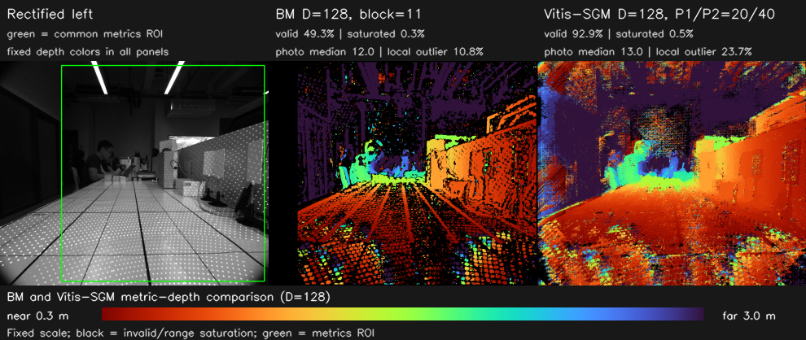

# 0725-test BM 与 SGBM 深度效果

> [返回项目 README](../../README.md)

本文档处理用户指定的数据集：

```text
/home/hcc/Desktop/Public/datasets/自研相机/0725-test
├── Image_20260725155901143.bmp
├── Image_20260725155906000.bmp
└── stereo_opencv_params-0723-1708.yaml
```

这里的 “SGBM” 指本仓库 `vitis_sgbm_cpu` 提取的 Vitis Census + 4 路径
SGM 标量 CPU 参考实现，图中标为 `Vitis-SGM`；它不是 OpenCV
`cv::StereoSGBM`。当前数据只有一对双目画面，没有逐像素真值深度，因此以下
结果用于比较深度覆盖、左右对应一致性和局部连续性，不用于声称绝对深度精度。


## 数据、左右顺序与处理口径

两张 BMP 没有 left/right 标识。脚本分别测试两个排列，使用
`StereoBM(D=128, block=11)` 的正视差有效率和左右回投灰度残差判定顺序：

| 候选顺序 | 正视差有效率 | 回投灰度残差中位数 | 灰度残差 ≤ 15 |
|---|---:|---:|---:|
| `...155906000.bmp → ...155901143.bmp` | **50.3%** | **12** | **55.0%** |
| `...155901143.bmp → ...155906000.bmp` | 23.0% | 27 | 33.8% |

因此本节采用：

| 角色 | 文件 |
|---|---|
| 左图 / Camera 1 | `Image_20260725155906000.bmp` |
| 右图 / Camera 2 | `Image_20260725155901143.bmp` |

两幅图先使用同目录 YAML 完成双目校正，再输入两种匹配算法。校正后的关键
参数与本次固定算法参数为：

| 项目 | 数值 |
|---|---:|
| 图像尺寸 | 1224×1024 |
| 校正焦距 `fx` | 658.169 px |
| 基线 | 61.791 mm |
| 主点偏移 `doffs` | 0 px |
| `fx × baseline` | 40669.158 px·mm |
| 视差数 `D` | 128 |
| BM | `block=11`，`preFilterCap=31`，`uniquenessRatio=15`，`textureThreshold=20` |
| Vitis-SGM | Census 5×5，4 路径，`P1/P2=20/40` |

公制深度按标定参数换算：

```text
Z_mm = 40669.158 / disparity_px
```

`D=128` 的最大有效视差按 127 px 计，对应理论最近深度约 320.2 mm。两种
结果使用完全相同的 0.3–3.0 m 固定色标：暖色为近、冷色为远、黑色为无效值
或搜索范围上限饱和。图中绿色框是统一指标 ROI，校正图坐标为
`(x0,y0,x1,y1)=(280,20,1204,1004)`。


## BM/SGBM 深度效果对比



| 算法 | 有效率 | 上限饱和率 | 回投残差中位数 | 残差 ≤ 15 | 局部异常率 | 中位视差 | ROI 中位深度 | CPU 时间 | 预计内存 |
|---|---:|---:|---:|---:|---:|---:|---:|---:|---:|
| StereoBM | 48.8% | **0.27%** | **14** | **53.1%** | **10.9%** | 43 px | 945.8 mm | **15.05 ms** | — |
| Vitis-SGM | **92.5%** | 0.52% | 15 | 50.3% | 23.9% | 45 px | 903.8 mm | 2614.68 ms | 1845.6 MiB |

指标定义与
[0724 多距离室内场景参数验证](experiment-0724-parameter-validation.md)
一致：

- **有效率**：公共 ROI 中视差大于 0、未落在搜索上限、且换算深度在
  0.15–10 m 内的像素比例。
- **上限饱和率**：视差位于最大搜索 bin 的像素比例，这些像素不作为可信
  深度显示。
- **回投残差**：根据左图视差在右图采样对应位置后的灰度绝对差，只能检验
  对应一致性，不能代替真值深度误差。
- **局部异常率**：有效视差相对 5×5 邻域中值偏差超过 2 px 的比例；真实
  物体边缘也可能被统计在内。

“ROI 中位深度”来自同时包含近处标定板、桌面、人物和远处背景的整块区域，
不是单个已知距离目标的测量值，只用于排查整体搜索范围饱和或数量级错误。


## 结果解读

- Vitis-SGM 把有效覆盖从 48.8% 提高到 92.5%，人物、桌面和右侧斜面上的
  黑色空洞明显少于 BM。
- BM 的有效像素局部异常率较低，且本机运行约 15.05 ms；Vitis-SGM 当前
  标量 CPU 参考实现约 2.61 s、1.80 GiB，约慢 174 倍，不适合作为实时 CPU
  路径。
- Vitis-SGM 的覆盖更完整，但局部异常率和回投残差没有优于 BM。画面中的
  高密度重复散斑会增加错误对应，所以“更满”不等于“绝对深度更准确”。
- 两个文件名中的时间戳相差约 4.857 s；目前不能确认它是否等于实际曝光
  时间差。若两幅图确实非同步采集，人物和手部等动态区域的错误对应不能只
  归因于 BM/SGBM 算法。
- 两种算法的搜索上限饱和率均低于 0.6%，说明 `D=128` 没有造成大面积
  近距离截断；若场景要稳定测量 0.32 m 内物体，仍需增大视差范围并重新评估
  时间、内存和重复纹理误匹配。

BM C++ 程序只保存 8 位显示图。评测脚本另用完全相同的 OpenCV 实现和参数
保留 Q4 原始视差，用于公制深度换算；本次 Q4 视差重新缩放后的显示图与
`vitis_bm_cpu` 输出逐像素匹配率为 100.0%。


## 复现实验

先编译两个 CPU 程序：

```bash
cd /home/hcc/Desktop/HXB/Vitis_Stereo_CPU_Ver
/usr/bin/cmake -S . -B build \
  -DCMAKE_BUILD_TYPE=Release \
  -DOpenCV_DIR=/home/hcc/Desktop/HXB/opencv-install-min/lib/cmake/opencv4
/usr/bin/cmake --build build --parallel
```

脚本支持两种输入方式。

**方式一：指定数据集目录并自动判定左右顺序。**

目录中必须正好包含两张 `*.bmp` 和一个 `*.yaml`。`0725-test` 是默认目录，
所以以下两条命令等价：

```bash
./scripts/evaluate_0725_test.py

./scripts/evaluate_0725_test.py \
  --dataset /home/hcc/Desktop/Public/datasets/自研相机/0725-test
```

**方式二：显式指定左图、右图和标定文件。**

```bash
./scripts/evaluate_0725_test.py \
  --left-image \
    /home/hcc/Desktop/Public/datasets/自研相机/0725-test/Image_20260725155906000.bmp \
  --right-image \
    /home/hcc/Desktop/Public/datasets/自研相机/0725-test/Image_20260725155901143.bmp \
  --calibration \
    /home/hcc/Desktop/Public/datasets/自研相机/0725-test/stereo_opencv_params-0723-1708.yaml \
  --output results/0725_test_explicit
```

`--left-image`、`--right-image`、`--calibration` 必须同时提供。显式模式严格
按给定角色处理，不再自动交换左右图；图像可以是 OpenCV 能读取的格式，但
尺寸必须与标定文件中的 `image_width/image_height` 一致。也可以分别使用
别名 `--left`、`--right` 和 `--calibration-file`。省略 `--output` 时仍会
写入 `results/0725_test`，因此处理其他画面时建议为每一对图指定独立输出目录。

脚本会自动判定左右顺序、完成双目校正、实际调用 `vitis_bm_cpu` 和
`vitis_sgbm_cpu`、生成原始视差与 16 位毫米深度、固定色标效果图、指标和
输入/标定元数据；显式模式会跳过自动判序。详细中间结果默认位于输出目录的
`details/` 子目录；`results/0725_test/details/` 被 Git 忽略。本文档使用并
纳入版本管理的结果为：

- [`results/0725_test/metrics.csv`](../../results/0725_test/metrics.csv)
- [`results/0725_test/metrics.json`](../../results/0725_test/metrics.json)
- [`results/0725_test/metadata.json`](../../results/0725_test/metadata.json)
