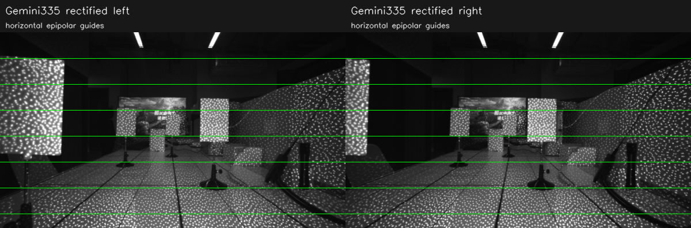
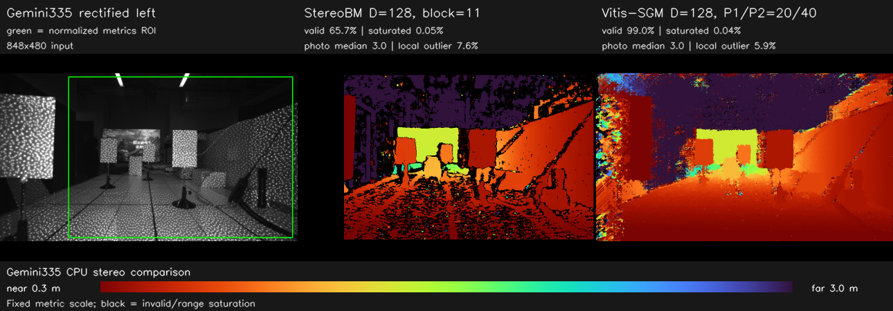
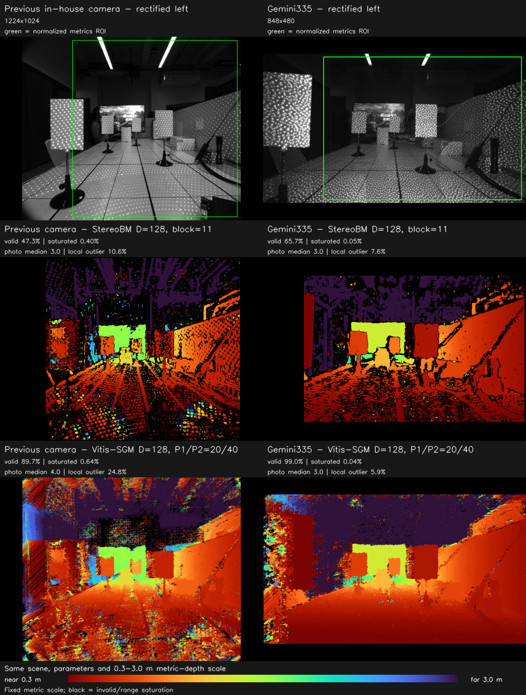

# Gemini335 0724 与之前相机的同场景横向对比

> [返回项目 README](../README.md)

本文档使用以下 Gemini335 数据和同目录标定参数：

```text
/home/hcc/Desktop/Public/datasets/gemini335/0724
├── gemini335_left_IR Left.png
├── gemini335_right_IR Right.png
└── stereo_opencv_params-0725.yaml
```

两幅图已有明确的 left/right 文件名，因此不再通过算法分数猜测左右顺序。
为和
[0724 多距离室内场景参数验证](experiment-0724-parameter-validation.md)
中的之前自研相机画面公平对比，两台相机均重新校正并运行相同配置：

| 算法 | 本节固定参数 |
|---|---|
| StereoBM CPU | `D=128`，`block=11`，`preFilterCap=31`，`uniquenessRatio=15`，`textureThreshold=20` |
| Vitis-SGM CPU | `D=128`，Census 5×5，4 路径，`P1/P2=20/40` |

所有深度图都使用同一个 0.3–3.0 m 公制色标，暖色为近、冷色为远、黑色为
无效值或视差搜索上限饱和。两组画面没有逐像素真值，所以本节比较的是有效
覆盖、左右对应一致性和局部连续性，不把这些诊断指标表述成绝对深度精度。


## 数据、标定与校正

Gemini335 标定文件经 `cv::stereoRectify` 等价的 OpenCV Python 接口处理后：

| 参数 | Gemini335 | 之前自研相机 |
|---|---:|---:|
| 图像尺寸 | 848×480 | 1224×1024 |
| 校正焦距 `fx` | 406.452 px | 658.169 px |
| 基线 | 50.281 mm | 61.791 mm |
| 主点偏移 `doffs` | 0 px | 0 px |
| `fx × baseline` | 20437.026 px·mm | 40669.158 px·mm |
| `D=128` 最大有效视差 | 127 px | 127 px |
| `D=128` 理论最近深度 | 160.9 mm | 320.2 mm |

深度仍按各自标定参数独立换算：

```text
Z_mm = rectified_fx_px × baseline_mm / (disparity_px + doffs_px)
```

下图只用于检查 Gemini335 校正后的极线关系。标定板、电视、桌面和右侧斜面
等对应结构均落在相同水平参考线上，没有观察到会直接破坏水平视差搜索的明显
垂直错位。




## 两种 CPU 算法的 Gemini335 结果

评价区域使用图中绿色框。它在两台相机上取相同的归一化坐标范围
`(0.23W, 0.02H)–(0.984W, 0.98H)`，并保证左边界大于 `D=128` 的搜索盲区。



| 算法 | 有效率 | 上限饱和率 | 回投残差中位数 | 残差 ≤ 15 | 局部异常率 | 中位视差 | ROI 中位深度 | CPU 时间 | 预计内存 |
|---|---:|---:|---:|---:|---:|---:|---:|---:|---:|
| StereoBM | 65.7% | 0.05% | 3 | 93.3% | 7.6% | 31.19 px | 655.3 mm | 5.68 ms | — |
| Vitis-SGM | **99.0%** | **0.04%** | 3 | 89.6% | **5.9%** | 29.00 px | 704.7 mm | 882.28 ms | 599.4 MiB |

这里的“ROI 中位深度”是包含前景板、桌面、支架和远处背景的整块场景统计，
不是某个已知距离目标的测量结果，不能作为绝对误差使用。它主要用于发现结果
是否整体贴在搜索上限或出现数量级错误；两种算法的上限饱和率都小于 0.05%，
说明 `D=128` 没有在这幅 Gemini335 画面中造成明显的近距离截断。

StereoBM 仍在暗区、遮挡边缘和低纹理区域保留较多黑色空洞，但前景板、桌面
和右侧斜面的有效覆盖已经较完整。Vitis-SGM 将有效率提高到 99.0%，并把局部
异常率降到 5.9%，大平面连续性明显优于 BM；代价是运行时间约为 BM 的
155 倍，且当前标量 CPU 实现需要约 599 MiB 工作内存。

BM 的 C++ 程序原本只写 8 位显示图。评测脚本另外通过完全相同的 OpenCV
实现和参数保留 Q4 原始视差用于深度换算，并把它重新缩放后与 C++ 输出做
逐像素检查；Gemini335 和之前相机两组的匹配率均为 100.0%。


## 与之前相机画面的直接对比

下图每一行都采用相同算法、相同参数和相同 0.3–3.0 m 色标；左列是
[0724 参数验证](experiment-0724-parameter-validation.md)
使用的之前自研相机，右列是 Gemini335。两台相机的分辨率、宽高比、视场、
焦距和基线不同，因此图像经过等比留黑边显示，没有拉伸到相同形状。



| 算法与指标 | 之前自研相机 | Gemini335 | 变化 |
|---|---:|---:|---:|
| BM 有效率 | 47.3% | **65.7%** | +18.4 个百分点 |
| BM 残差 ≤ 15 | 86.4% | **93.3%** | +6.9 个百分点 |
| BM 局部异常率 | 10.6% | **7.6%** | −3.0 个百分点 |
| BM CPU 时间 | 13.87 ms | **5.68 ms** | 约 2.44× 更快 |
| Vitis-SGM 有效率 | 89.7% | **99.0%** | +9.3 个百分点 |
| Vitis-SGM 残差 ≤ 15 | 81.6% | **89.6%** | +8.1 个百分点 |
| Vitis-SGM 局部异常率 | 24.8% | **5.9%** | −18.9 个百分点 |
| Vitis-SGM CPU 时间 | 2691.80 ms | **882.28 ms** | 约 3.05× 更快 |
| Vitis-SGM 预计内存 | 1845.6 MiB | **599.4 MiB** | 约 3.08× 更少 |

视觉上，Gemini335 的 BM 在桌面和右侧大斜面上的空洞更少；Vitis-SGM 的
改善更明显，之前相机画面中的大面积彩色散斑和条纹在 Gemini335 结果中显著
减少，前景板、桌面与斜面的深度层次更连续。这与更高的回投命中率和更低的
局部异常率方向一致。

运行时间和内存的下降不能直接归因于算法或传感器质量：Gemini335 图像只有
848×480，像素数约为之前 1224×1024 画面的 32.5%。Vitis-SGM 的代价体
内存近似正比于 `宽×高×D`，所以约 3.08 倍的内存差主要来自输入分辨率。


## 结论与适用边界

对当前同场景单帧数据，可以得出：

- Gemini335 配合 `D=128` 时，两种算法都没有明显搜索上限截断。
- 速度优先时可用 StereoBM `D=128, block=11`：本机约 5.68 ms，代价是
  仍有约 34.3% 的 ROI 像素无有效深度。
- 完整性和大平面连续性优先时，Vitis-SGM `D=128, P1/P2=20/40`
  明显更好：有效率 99.0%，局部异常率 5.9%，但标量 CPU 版本约 882 ms、
  599 MiB，不适合直接作为实时 CPU 路径。
- 相比之前相机，同参数下 Gemini335 的左右对应一致性和局部连续性都更好；
  其中 Vitis-SGM 的视觉改善最明显。

仍不能据此声称 Gemini335 的“绝对深度精度”更高。两台相机具有不同视场、
分辨率、基线、投射散斑和标定参数，且本次只有一对没有同步真值的场景图。要
比较毫米级精度，应在两台相机的公共视场中放置多个从左相机光心精确测距的
平面，统一曝光/增益，并分别报告目标 ROI 的偏差、方差、空洞率和边缘误差。


## 复现实验

```bash
cd /home/hcc/Desktop/HXB/Vitis_Stereo_CPU_Ver
/usr/bin/cmake -S . -B build \
  -DCMAKE_BUILD_TYPE=Release \
  -DOpenCV_DIR=/home/hcc/Desktop/HXB/opencv-install-min/lib/cmake/opencv4
/usr/bin/cmake --build build --parallel
./scripts/evaluate_gemini335_0724.py
```

脚本会：

1. 读取两台相机各自的 YAML 并校正左右图；
2. 对 Gemini335 和之前相机分别调用 `vitis_bm_cpu` 与
   `vitis_sgbm_cpu` C++ 可执行程序；
3. 生成原始视差、16 位毫米深度、固定色标图、校正检查图和横向对比图；
4. 输出机器可读指标和完整输入/标定元数据。

详细中间结果位于 `results/gemini335_0724/details/`，该目录被 Git 忽略；
本文档使用并纳入版本管理的结果为：

- [`results/gemini335_0724/metrics.csv`](../results/gemini335_0724/metrics.csv)
- [`results/gemini335_0724/metrics.json`](../results/gemini335_0724/metrics.json)
- [`results/gemini335_0724/metadata.json`](../results/gemini335_0724/metadata.json)
