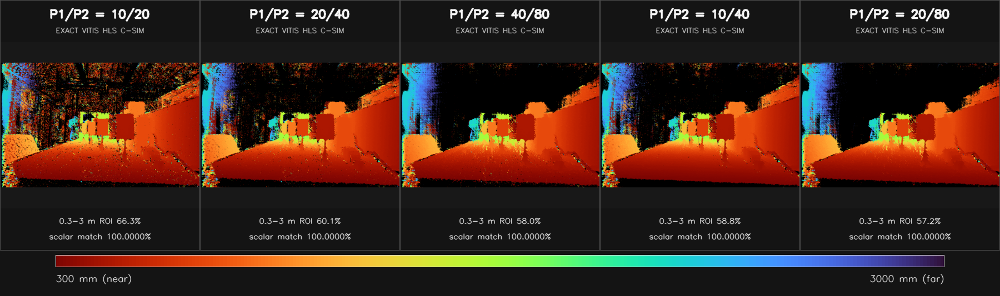

# Gemini335 1280×800 Vitis-SGBM FPGA 等效参数对比

> [返回 SGBM 文档索引](README.md) · [返回总文档索引](../README.md) ·
> [返回项目 README](../../README.md)

## 结论先行

原有的
[15 组 D×P1/P2 扫描](../../results/gemini335_1280x800_sgbm_sweep/VITIS_SGBM_PARAMETER_COMPARISON.md)
使用了正确的 Gemini335 1280×800 数据，也适合观察参数趋势，但**不能直接作为
当前 FPGA 核的等效效果**。原因是原报告使用四路径标量参考，而本机当前
1280×800 Vitis FPGA/HLS 工程的固定配置是：

```text
D=128, PU=64, NUM_DIR=3, WINDOW_SIZE=5, XF_NPPC1
```

`NUM_DIR=3` 与原来的四路径不同，会改变路径代价和最终视差。因此本次重新跑了
CPU 仿真，并使用两层验证：

1. 优化标量 CPU 参考固定为与 FPGA 相同的 `D=128、R=3、W=5`，扫描五组
   `P1/P2`，用于快速生成深度图、反向视差和量化指标；
2. 对同样五组参数，直接调用当前 FPGA 工程的
   `gemini335_sgbm_accel.cpp`、Vitis Vision 2021.1
   `xf::cv::SemiGlobalBM` 和同一毫米深度 LUT，完成 1280×800 全帧 HLS C 仿真。

五组配置的 HLS C 仿真深度与优化标量 CPU 深度均达到：

```text
逐像素一致率 = 100.0000%
差异像素     = 0 / 1,024,000
最大深度差   = 0 mm
```

所以，本文新生成的**原始深度效果可以作为当前 Vitis FPGA 核的位精确功能模型
输出**，不需要为了比较 P1/P2 再上板实测。需要注意，这一结论只覆盖本文冻结的
输入、Vitis 源码、HLS 编译期配置和五组 P1/P2；更换任意一项都应重新执行校验。

## 为什么原有结果只能保留作趋势参考

原报告与本次最终报告的区别如下：

| 项目 | 原有结果 | 本次 FPGA 等效结果 |
|---|---|---|
| 输入数据 | 指定的 Gemini335 1280×800 左右图 | 相同左右图 |
| 算法来源 | Vitis `sgbm` 测试台标量参考 | 相同标量递推，并由真实 HLS 核逐像素验算 |
| Census | 5×5 | 5×5 |
| 聚合路径 | 4：左、左上、上、右上 | **3：左、左上、上** |
| D | 64/128/256 软件扫描 | **固定 128，与当前 FPGA 模板参数一致** |
| PU | 标量 CPU 不模拟 | **64，与当前 FPGA 模板参数一致** |
| P1/P2 | 五组 | 相同五组 |
| 输出证明 | 标量程序重复运行一致 | **五组均与 HLS C 仿真逐像素 100% 一致** |

`TOTAL_DISPARITY`、`NUM_DIR` 和 `PARALLEL_UNITS` 是 HLS 模板参数，不是同一
FPGA 核运行时可以任意切换的寄存器。当前硬件是 `D=128/R=3/PU=64`，所以
本文不把旧报告中的 D=64、D=256 图混入 FPGA 等效排名。如果以后确实要比较
D=64 或 D=256 的 FPGA 效果，应分别建立对应 HLS 模板实例、运行 C 仿真并
重新评估资源与时序。

## 输入数据和固定标定

数据来源：

```text
/home/hcc/Desktop/Public/datasets/gemini335/1280*800分辨率/data
├── left_IR_IR Left.png
├── right_IR_IR Right.png
└── Gemini335_CP06563000SS_IR_1280x800_all.yaml
```

左右 PNG 是 1280×800、8 位三通道文件，但三个通道逐像素完全相同；转换成
灰度不会改变像素值。标定文件声明 `parameters_are_rectified=1`，畸变参数为
0，`R1/R2` 为单位阵，所以左右图按当前相机输出契约直接进入 SGBM，没有再次
进行插值 remap。


固定深度参数为：

| 参数 | 数值 |
|---|---:|
| 图像尺寸 | 1280×800 |
| `fx` | 619.2955322 px |
| 基线 | 50.38830185 mm |
| `fx × baseline` | 31205.250210849994 px·mm |
| 主点视差偏移 | 0 px |
| 最大整数视差 | 127 px |
| 理论最近深度 | 245.7 mm |

FPGA 核不是在 PS/CPU 上做浮点除法，而是使用和当前 HLS 顶层相同的 128 项
整数 LUT：

```text
d=0 或 d=1  -> depth=0
d=2..127    -> depth_mm=round(31205.250210849994 / d)
```

`d=1` 对应约 31.2 m，超过当前 20 m 输出合同，因此也置零。

## 与当前 FPGA 核一致的 HLS 配置

本报告以本机当前已有的 Gemini335 1280×800 FPGA 工程为目标合同：

```text
/home/hcc/Desktop/HXB/FPGA_Camera_V2/
  0805-AXU5EVB_Board_SGBM_1280x800/
  Vitis_Libraries/vision/L1/examples/gemini335_sgbm_pl
```

| 配置项 | 固定值 | 对效果的含义 |
|---|---:|---|
| Vitis Vision | 2021.1 | 使用该版本 `xf_sgbm.hpp` 的实际定点/整数语义 |
| `TOTAL_DISPARITY` | 128 | 搜索视差 0–127 |
| `WINDOW_SIZE` | 5 | 5×5 Census，24 bit 描述子 |
| `NUM_DIR` | 3 | 左、左上、上三条前向路径 |
| `PARALLEL_UNITS` | 64 | 每批处理 64 个视差；主要影响结构和吞吐 |
| `NPC` | `XF_NPPC1` | 每时钟一个像素接口 |
| 输入 | `XF_8UC1` | 8 位灰度 |
| 视差输出 | `XF_8UC1` | 整数像素视差，无亚像素 |
| 深度输出 | `XF_16UC1` | PL 内查表得到 uint16 毫米深度 |
| 后处理 | 无 | 无 uniqueness、speckle、LR check 或置信度拒绝 |

`P1/P2` 是核函数端口，所以在算法模型中可以运行时改变；但当前部署侧合同仍把
`20/40` 作为固定默认值。如果以后实际部署其他惩罚值，需要同步调整主机侧参数
校验和构建合同，不能只改显示程序。

## 五组真实 HLS C 仿真原始深度效果

下图中的每一个像素都来自真实 Vitis HLS C 仿真的 uint16 毫米深度输出，不是
OpenCV `StereoSGBM`，也不是仅用于示意的后处理图。所有配置使用同一
300–3000 mm 色标：红色较近、蓝紫色较远、黑色表示深度为 0 或不在固定显示
范围内。



图中 `0.3–3 m ROI` 是公共 ROI 内深度落在固定显示范围的比例，不是总有效率，
更不能直接视为准确率。惩罚增强后，一部分背景被平滑为 3 m 以外的较远深度，
所以这个比例下降；这不等于算法产生了更多无效像素。

从原始效果可见：

- `10/20` 平滑约束最弱，暗区、左侧结构和地面出现最多的彩色颗粒及局部跳变；
- `20/40` 明显减少散点，同时仍保留较多边缘变化，是 Vitis 默认基线；
- `40/80` 更强调连续平面，远处和地面更平滑，但部分边界被更强地传播；
- `10/40` 在保持较低相邻视差惩罚的同时抑制大跳变，当前画面的左右一致覆盖
  最高；
- `20/80` 的原始局部离群率最低，视觉上最平滑，但对细杆、窄物体和真实深度
  突变的侵蚀风险也最大。

## HLS C 仿真与优化 CPU 参考逐像素验证

| P1/P2 | HLS C 仿真时间¹ | HLS 有效深度² | 与标量 CPU 一致率 | 差异像素 | 最大深度差 |
|---:|---:|---:|---:|---:|---:|
| 10/20 | 33.037 s | 98.675% | **100.0000%** | **0** | **0 mm** |
| 20/40 | 32.803 s | 98.953% | **100.0000%** | **0** | **0 mm** |
| 40/80 | 32.978 s | 99.154% | **100.0000%** | **0** | **0 mm** |
| 10/40 | 33.316 s | 99.051% | **100.0000%** | **0** | **0 mm** |
| 20/80 | 32.966 s | 99.157% | **100.0000%** | **0** | **0 mm** |

¹ 这是主机上的 HLS C 功能仿真耗时，不是 FPGA 延时，也不能换算成帧率。

² “HLS 有效深度”只表示 LUT 输出大于 0。Vitis 核对每个像素强制执行最小
代价选择，没有置信度拒绝，因此约 99% 的非零输出不等于约 99% 的正确匹配。

逐像素比较的对象是：

```text
真实 HLS 核：
  gemini335_sgbm_accel.cpp
  -> xf::cv::SemiGlobalBM<D128, PU64, R3, W5>
  -> FPGA 同款 uint16 深度 LUT

优化标量 CPU：
  src/vitis_sgbm_cpu.cpp --paths 3
  -> 整数视差
  -> 同一 uint16 深度 LUT
```

完整机器可读证据：

- [逐配置验证 CSV](../../results/gemini335_1280x800_sgbm_fpga_equiv/hls_csim_validation.csv)
- [源文件 SHA-256、配置和验证 JSON](../../results/gemini335_1280x800_sgbm_fpga_equiv/hls_csim_validation.json)
- [Vitis HLS C 仿真日志](../../results/gemini335_1280x800_sgbm_fpga_equiv/hls_csim/gemini335_sgbm_accel_csim.log)
- [标量扫描原始指标 CSV](../../results/gemini335_1280x800_sgbm_fpga_equiv/metrics.csv)
- [标量扫描元数据 JSON](../../results/gemini335_1280x800_sgbm_fpga_equiv/metadata.json)

为了防止以后误把不同源码生成的图混在一起，验证 JSON 保存了 FPGA 顶层、
HLS 配置、`xf_sgbm.hpp`、左右输入和标定文件的完整 SHA-256。本轮关键哈希为：

| 对象 | SHA-256 |
|---|---|
| `gemini335_sgbm_accel.cpp` | `73c29777d109e59c916bc9f6012c7add84f7ea3359164098978e2cb6a030efcd` |
| `gemini335_sgbm_config.hpp` | `fa04a356bedcd5b0905a1fc68502cad1296d4b3ffe2e96f2646b8cd9049c774a` |
| Vitis `xf_sgbm.hpp` | `eeadd5a9f01f20e56b1a643a1a293e2168605e1bce28681895d29568441b1539` |
| 左图 | `bac2e64836fb5aade1b4e825062849485bd1707f7030c9b390edb8de07107cdd` |
| 右图 | `d02d0574dcc6373bb03cdbe28f31235f057956107cab814d4d53907671db1325` |
| 标定 YAML | `a26c5e066ccfd339c4ed97bcf609e2e98c92a7fd5ffd8c70ada2980882a4d96b` |

## 外部左右一致性审计

当前 Vitis FPGA 核没有内置 right-to-left 检查。为了避免把强制 WTA 产生的
“满图输出”误当成可靠深度，评估脚本额外对水平翻转后的右→左图运行同一算法，
然后要求左右整数视差差值不超过 1 px。下图是外部诊断结果，**不属于当前
FPGA 核原始输出**；若要让板端直接产生同样掩膜，必须另行实现并计入硬件资源
与延时。


统一公共 ROI 为：

```text
(x0, y0, x1, y1) = (138, 10, 1270, 790)
```

左边界避开 `D=128` 的搜索盲区并保留 10 像素比较边界。指标如下：

| P1/P2 | LR 一致覆盖 | LR 光度≤15 | 原始局部离群>2px | LR 中位视差 | LR 中位深度 |
|---:|---:|---:|---:|---:|---:|
| 10/20 | 62.1% | 78.0% | 18.21% | 48 px | 650.1 mm |
| **20/40** | **69.9%** | **80.5%** | **8.55%** | 38 px | 821.2 mm |
| 40/80 | 66.8% | **82.2%** | 5.99% | 21 px | 1486.0 mm |
| **10/40** | **75.3%** | 80.0% | **5.72%** | 41 px | 761.1 mm |
| **20/80** | **72.9%** | 80.4% | **3.56%** | 29 px | 1076.0 mm |

这些中位深度来自包含近景板、地面和远处背景的整块 ROI，不是某个固定目标的
测距结果。不同 P1/P2 改变哪些像素通过 LR 审计，因此不能用中位深度大小判断
哪组更准确。

指标支持以下判断：

- `10/20` 的 LR 覆盖最低、局部离群最高，不适合当前画面；
- `20/40` 是较均衡的默认基线，没有极端强化平滑；
- `10/40` 的 LR 一致覆盖最高，为 75.3%，同时局部离群率降至 5.72%，适合
  作为“覆盖与边缘折中”候选；
- `20/80` 的局部离群率最低，为 3.56%，LR 覆盖仍有 72.9%，适合平面连续性
  优先的候选；
- `40/80` 的光度命中率最高，但 LR 覆盖只有 66.8%，而且强 P1/P2 更容易跨
  真实边缘传播，当前没有足够证据优先于 `20/80`。

## 推荐参数

针对当前单帧 Gemini335 1280×800 数据：

| 使用目标 | 建议参数 | 理由 |
|---|---|---|
| 默认、风险最低的可复现基线 | **D=128，R=3，P1/P2=20/40** | 当前 FPGA 默认合同；平滑和边缘保留较均衡 |
| 左右一致覆盖优先 | **D=128，R=3，P1/P2=10/40** | LR 覆盖最高 75.3%，局部离群仅 5.72% |
| 大平面平滑优先 | **D=128，R=3，P1/P2=20/80** | 局部离群最低 3.56%，LR 覆盖 72.9% |
| 不建议作为当前首选 | D=128，R=3，P1/P2=10/20 | 噪点和局部跳变最多 |

在没有真实深度之前，不应把 `10/40` 或 `20/80` 宣称为“精度最高”。最终选择
至少还需要加入：已知距离平面、弱纹理墙面、细杆/电缆、遮挡边缘、斜面和
0.25–3 m 多距离目标，并报告偏差、MAE、RMSE、P95、空洞率和边缘误差。

## “与 FPGA 一样”的适用边界

本次采用的是 HLS C 仿真，而不是 OpenCV 近似算法。它执行和综合输入相同的
Vitis C++ 模板、`ap_uint` 位宽、边界规则、路径缓存、WTA 和深度 LUT；因此
在相同输入和寄存器参数下，它是预期 FPGA 功能输出的位精确模型。

仍需区分三个层次：

1. **本文已经证明**：优化标量 CPU 与 Vitis HLS C 仿真五组均逐像素一致；
2. **HLS 工具设计目标**：综合后的 RTL 应保持 C 模型功能语义；
3. **本文没有重新执行**：五组全帧 C/RTL 协同仿真和五组上板回读。

用户当前要求“不用上板实测”，所以 HLS C 仿真已经满足算法效果筛选；如果将来
需要签核工具链或接口级异常，再补默认候选的 C/RTL co-sim，而不是重新使用
OpenCV `StereoSGBM` 作为替代。

## 复现实验

### 1. 运行三路径优化 CPU 扫描

```bash
cd /home/hcc/Desktop/HXB/Vitis_Stereo_CPU_Ver

python3 scripts/run_vitis_sgbm_parameter_sweep.py \
  --non-interactive \
  --dataset "/home/hcc/Desktop/Public/datasets/gemini335/1280*800分辨率/data" \
  --calibration "/home/hcc/Desktop/Public/datasets/gemini335/1280*800分辨率/data/Gemini335_CP06563000SS_IR_1280x800_all.yaml" \
  --output results/gemini335_1280x800_sgbm_fpga_equiv \
  --disparities 128 \
  --penalty-disparity 128 \
  --penalty-pairs 10/20,20/40,40/80,10/40,20/80 \
  --range-p1 20 --range-p2 40 \
  --paths 3 --runs 3 --lr-tolerance-px 1 \
  --depth-min-mm 300 --depth-max-mm 3000
```

### 2. 运行真实 Vitis HLS 全帧 C 仿真并逐像素验算

```bash
python3 scripts/run_vitis_hls_csim_parameter_sweep.py
```

该命令使用：

- [HLS 数据集测试台](../../hls_csim/tb_gemini335_dataset.cpp)
- [Vitis HLS C 仿真 Tcl](../../hls_csim/run_dataset_csim.tcl)
- [HLS/标量结果分析脚本](../../scripts/analyze_vitis_hls_csim_results.py)

如果五个 PGM 已存在，只重新生成验证、PNG 和汇总图：

```bash
python3 scripts/run_vitis_hls_csim_parameter_sweep.py --reuse-csim
```

本机本轮全分辨率五组 HLS C 仿真约需 169 秒。该时间只用于复现功能结果，
不能当作 FPGA 性能数据。

## 结果文件

主要汇总文件位于：

```text
results/gemini335_1280x800_sgbm_fpga_equiv/
├── comparison_hls_csim_penalties.png
├── comparison_penalties_raw.png
├── comparison_penalties_lr.png
├── metrics_penalties.png
├── metrics.csv
├── metadata.json
├── hls_csim_validation.csv
├── hls_csim_validation.json
├── hls_csim/
│   ├── gemini335_sgbm_accel_csim.log
│   ├── hls_depth_p1_*_p2_*.pgm
│   ├── hls_depth_p1_*_p2_*_u16.png
│   └── hls_depth_p1_*_p2_*_color.png
└── details/
    └── d128_p1*_p2*/
```

`hls_csim/` 中的 PGM 和 uint16 PNG 是真实 HLS C 仿真毫米深度；`details/`
中的原始整数视差、反向视差和 LR 掩膜来自已经通过位精确验证的优化标量实现。
