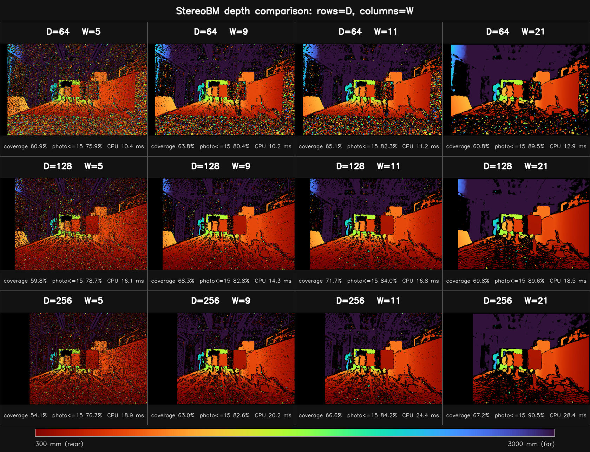
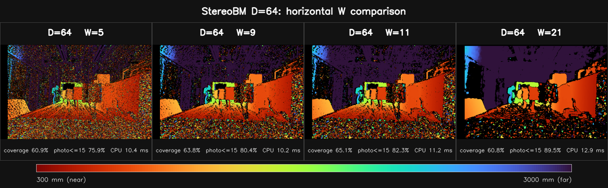
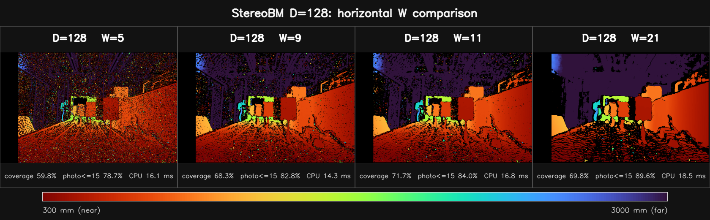
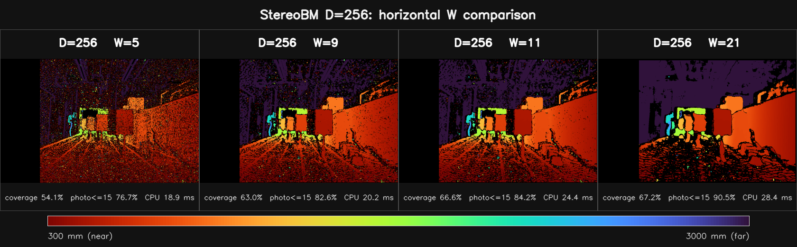
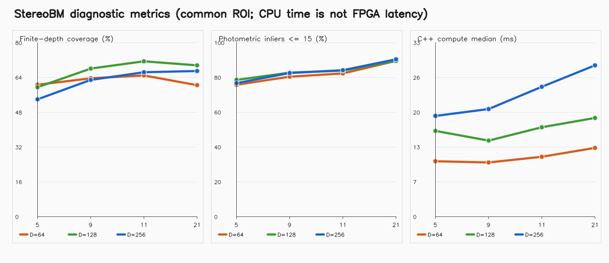

# Gemini335 StereoBM：D/W 参数深度图横向对比

## 技术摘要

本报告对仓库 `src/vitis_bm_cpu.cpp` 的 StereoBM 参数做了 3×4 组扫描：D=64,128,256，W=5,9,11,21。所有深度图使用同一色标 300–3000 mm（红色近、蓝色远、黑色无效），因此可以直接比较。

有限深度覆盖率最高的是 D=128, W=11（71.7%）；光度残差≤15 的占比最高的是 D=256, W=21（90.5%）；本机 C++ 中位计算时间最短的是 D=64, W=9（10.2 ms）。这些指标没有真值监督，只能用于诊断和参数筛选，不能等同于深度精度。

### 本次数据的直接结论

- **优先候选：D=128, W=11。**它在共同 ROI 上得到 71.7% 的有限深度覆盖，光度≤15 占比 84.0%，搜索顶端饱和仅 0.05%，本机 C++ 中位时间 16.8 ms。这表示它适合作为后续 HLS 候选，但不表示已经证明深度最准确。
- **D=64 对本场景偏小。**其理论最近范围是 495.3 mm，本轮不同 W 的平均顶端饱和率为 2.53%；近处物体会更容易被截到最大视差。
- **W 从 5 增至 21 后，图面明显更连续，但细杆、电缆及遮挡边界更容易被聚合。**在 D=128 下，光度≤15 占比从 78.7% 变化到 89.6%，覆盖率从 59.8% 变化到 69.8%。
- **新增 W=9 与 W=11 很接近，适合作为硬件窗口折中候选。**在 D=128 下，W=9 的覆盖率为 68.3%、光度≤15 占比为 82.8%、本机 C++ 中位时间为 14.3 ms；W=11 对应为 71.7%、84.0% 和 16.8 ms。
- **D=256 只在需要更近距离时值得优先考虑。**同为 W=11，其本机 CPU 中位时间为 24.4 ms，而 D=128 为 16.8 ms；共同 ROI 覆盖率分别为 66.6% 和 71.7%。

## 关键发现与可视证据



上图是最重要的对比：每个单元格都使用完全相同的毫米色标。D 决定最大搜索视差及最近可测距离；W 决定局部匹配聚合范围。通常小 W 更可能保留物体边缘但出现噪点，大 W 会提高局部连续性，同时更容易在深度边界产生前景/背景混合。黑色区域是无有效正视差，不是零毫米深度。

### D=64：不同 W 横向对比



D=64 的理论最大整数视差约为 63 px；按本标定参数估算，最近可测距离约 495.3 mm。横向查看 W=5、9、11、21，可重点观察支架边缘、右侧大斜面、桌面电缆和远处暗区域的孔洞、噪声与边界扩散。

### D=128：不同 W 横向对比



D=128 的理论最大整数视差约为 127 px；按本标定参数估算，最近可测距离约 245.7 mm。横向查看 W=5、9、11、21，可重点观察支架边缘、右侧大斜面、桌面电缆和远处暗区域的孔洞、噪声与边界扩散。

### D=256：不同 W 横向对比



D=256 的理论最大整数视差约为 255 px；按本标定参数估算，最近可测距离约 122.4 mm。横向查看 W=5、9、11、21，可重点观察支架边缘、右侧大斜面、桌面电缆和远处暗区域的孔洞、噪声与边界扩散。

### 无真值诊断指标



覆盖率和光度一致性统一在共同 ROI 上计算，以免 D 越大导致左侧天然搜索盲区越宽而产生不公平比较。光度指标把右图按估计视差回投到左图后计算灰度绝对差；遮挡、曝光变化和投影散斑都会影响它。图中的 CPU 时间只反映当前主机 OpenCV 参考实现，不是 FPGA 延时。

## 完整指标表

| D | W | 最近范围/mm | 有限深度覆盖/% | 顶端饱和/% | 中位视差/px | 深度 P10/P50/P90 mm | 光度中位误差 | 光度≤15/% | 局部离群>2px/% | C++ 中位时间/ms | C++/Python 图一致/% |
|---:|---:|---:|---:|---:|---:|---:|---:|---:|---:|---:|---:|
| 64 | 5 | 495.3 | 60.9 | 2.14 | 32.31 | 546.3/965.7/6015.5 | 4.0 | 75.9 | 0.4 | 10.41 | 100.0000 |
| 64 | 9 | 495.3 | 63.8 | 2.58 | 26.44 | 548.1/1180.3/6164.0 | 3.0 | 80.4 | 0.0 | 10.22 | 100.0000 |
| 64 | 11 | 495.3 | 65.1 | 2.64 | 21.44 | 551.1/1455.6/6241.0 | 3.0 | 82.3 | 0.0 | 11.24 | 100.0000 |
| 64 | 21 | 495.3 | 60.8 | 2.75 | 7.81 | 566.1/3994.3/6320.1 | 2.0 | 89.5 | 0.0 | 12.90 | 100.0000 |
| 128 | 5 | 245.7 | 59.8 | 0.21 | 51.31 | 317.2/608.1/5427.0 | 4.0 | 78.7 | 0.5 | 16.14 | 100.0000 |
| 128 | 9 | 245.7 | 68.3 | 0.07 | 45.50 | 340.3/685.8/5873.9 | 3.0 | 82.8 | 0.0 | 14.27 | 100.0000 |
| 128 | 11 | 245.7 | 71.7 | 0.05 | 43.31 | 349.9/720.5/5943.9 | 3.0 | 84.0 | 0.0 | 16.78 | 100.0000 |
| 128 | 21 | 245.7 | 69.8 | 0.01 | 27.31 | 419.9/1142.5/6088.8 | 3.0 | 89.6 | 0.0 | 18.52 | 100.0000 |
| 256 | 5 | 122.4 | 54.1 | 0.10 | 58.31 | 190.9/535.1/5147.3 | 4.0 | 76.7 | 0.5 | 18.92 | 100.0000 |
| 256 | 9 | 122.4 | 63.0 | 0.06 | 47.88 | 320.3/651.8/5805.6 | 3.0 | 82.6 | 0.0 | 20.23 | 100.0000 |
| 256 | 11 | 122.4 | 66.6 | 0.05 | 44.00 | 337.4/709.2/5943.9 | 3.0 | 84.2 | 0.0 | 24.42 | 100.0000 |
| 256 | 21 | 122.4 | 67.2 | 0.04 | 25.94 | 422.4/1203.1/6088.8 | 3.0 | 90.5 | 0.0 | 28.41 | 100.0000 |

逐组的原始 Q4 视差、毫米深度、彩色深度图、C++ 输出和运行日志见 [`details/`](details/)，机器可读数据见 [`metrics.csv`](metrics.csv) 与 [`metadata.json`](metadata.json)。

## 数据、标定与度量范围

- 左图：`/home/hcc/Desktop/Public/datasets/gemini335/1280*800分辨率/data/left_IR_IR Left.png`
- 右图：`/home/hcc/Desktop/Public/datasets/gemini335/1280*800分辨率/data/right_IR_IR Right.png`
- 标定来源：`/home/hcc/Desktop/Public/datasets/gemini335/1280*800分辨率/data/Gemini335_CP06563000SS_IR_1280x800_all.yaml`
- 输入尺寸：1280×800
- 校正方式：YAML 标明输入已校正，未二次 remap
- 焦距：619.2955322 px
- 基线：50.3883018 mm
- fx×baseline：31205.2502108 mm·px
- 主点视差偏移 `cx_right-cx_left`：0.0000000 px
- 深度公式：`Z_mm = 31205.2502108 / (disparity_px + 0.0000000)`
- 共同评价 ROI：`x=[266,1270)`, `y=[10,790)`
- 生成时间：2026-08-03T10:04:21+08:00


绿色水平线用于快速检查校正方向；当前 Orbbec YAML 标明输入已经由 SDK 校正，脚本因此直接使用图像，没有再次 remap。

## 方法

每一组参数都实际调用仓库构建出的 `build/vitis_bm_cpu`。固定参数与仓库源码一致：`PREFILTER_XSOBEL`、preFilterCap=31、uniquenessRatio=15、textureThreshold=20、minDisparity=0。C++ 程序只输出按 Vitis testbench 规则缩放的 8 位视差图，所以脚本再以相同 OpenCV 参数计算一次 signed Q4 视差用于毫米深度换算，并逐像素核对两者；本轮所有配置的最低一致率为 100.0000%。

每组 C++ 核心 compute 计时重复 5 次并报告中位数；不包括 Python 绘图和报告生成。共同 ROI 根据本轮最大 D 和最大 W 构造，仅对有效正视差计算深度统计。局部离群率只在完整有效的 5×5 邻域中统计。

## 限制与稳健性说明

- 数据只有一对画面且没有真值深度，无法报告 MAE、RMSE 或绝对精度；视觉效果与诊断指标应结合使用。
- D/W 在 FPGA HLS 实现中通常是编译期配置；CPU 参数扫描不能推出 LUT、FF、BRAM、DSP、II 或 Fmax。
- C++ CPU 时间受主机、OpenCV 构建、线程与系统负载影响，不能作为 FPGA 延时估计。
- D 增大会扩展近距离搜索范围，也会扩大图像左侧的天然不可匹配区域，并通常增加硬件代价。
- W 增大会增强局部聚合与平滑，但可能模糊细杆、电缆和物体遮挡边界。

## 下一步建议

先从本报告中选 2–3 个互补候选组合；建议保留 D=128/W=11 作为折中基线，同时比较 W=9 的较小窗口折中，再加入 W=5 的保边缘方向和 W=21 的平滑方向。本轮光度指标最高的是 D=256/W=21。然后用更多近景、弱纹理、强遮挡样本复测。

若目标是评估 FPGA 性能，下一阶段应直接对对应 Vitis Vision HLS 顶层做 C 仿真/综合：C 仿真验证像素输出；C 综合报告 LUT/FF/BRAM/DSP、目标时钟与估计 latency/II；暂时不上板也能完成这两步。只有板上运行才能最终验证 DDR/AXI、DMA 和端到端帧率。

## 可复现运行

交互式运行：

```bash
cd "/home/hcc/Desktop/HXB/Vitis_Stereo_CPU_Ver"
./scripts/run_stereobm_depth_sweep.py
```

本轮等价的非交互命令：

```bash
python3 scripts/run_stereobm_depth_sweep.py \
  --non-interactive --dataset "/home/hcc/Desktop/Public/datasets/gemini335/1280*800分辨率/data" \
  --left "/home/hcc/Desktop/Public/datasets/gemini335/1280*800分辨率/data/left_IR_IR Left.png" --right "/home/hcc/Desktop/Public/datasets/gemini335/1280*800分辨率/data/right_IR_IR Right.png" \
  --calibration "/home/hcc/Desktop/Public/datasets/gemini335/1280*800分辨率/data/Gemini335_CP06563000SS_IR_1280x800_all.yaml" \
  --output "/home/hcc/Desktop/HXB/Vitis_Stereo_CPU_Ver/results/gemini335_1280x800_bm_sweep" \
  --disparities 64,128,256 \
  --windows 5,9,11,21 \
  --depth-min-mm 300 --depth-max-mm 3000 --runs 5
```

## 进一步问题

- 最终 FPGA 型号、目标时钟和 Vitis/Vitis Vision 版本是什么？这些决定资源与时序结论。
- 实际工作距离范围和最小目标尺寸是多少？它们决定 D 与 W 的优先级。
- 后续是否有测距标靶或结构光/激光真值？有真值后才能把“视觉更平滑”与“深度更准确”区分开。
