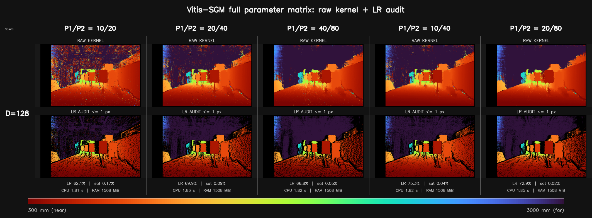
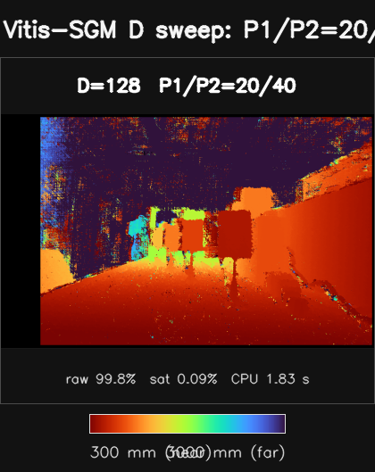
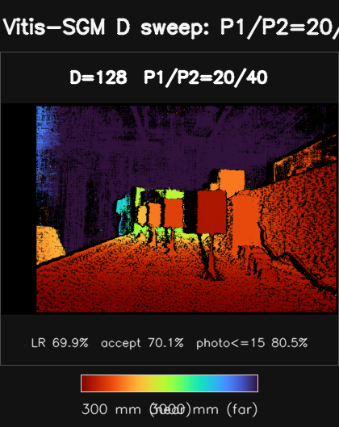
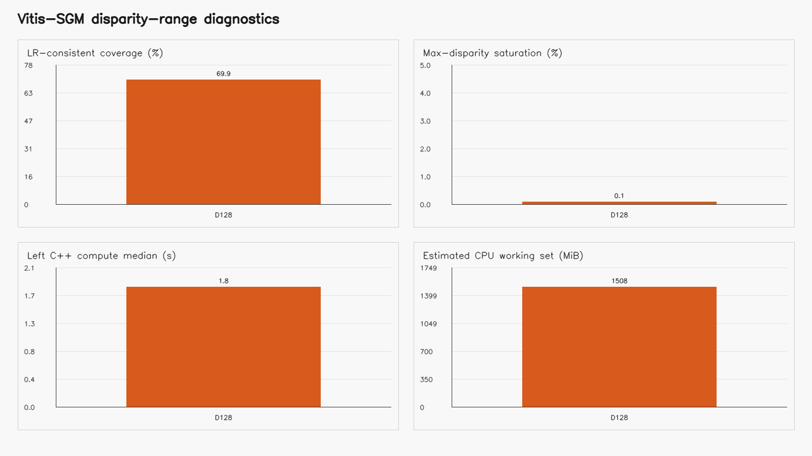
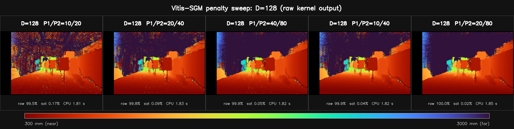
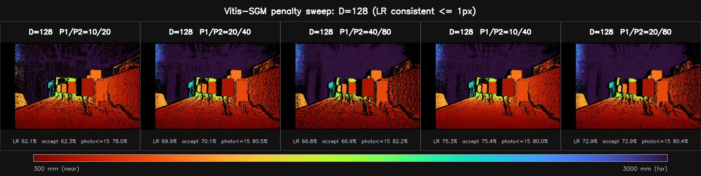
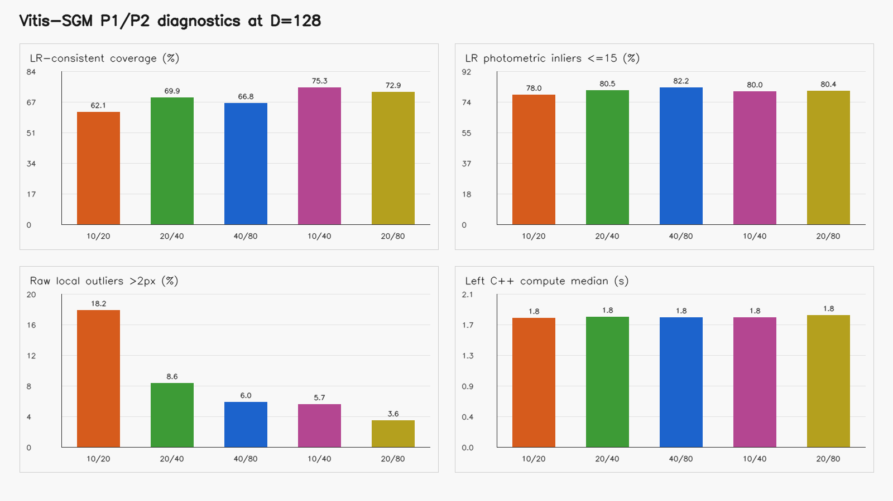

# Gemini335 Vitis-SGBM/SGM：D 与 P1/P2 参数效果对比

## 技术摘要

本报告测试的是仓库 `src/vitis_sgbm_cpu.cpp`：Vitis `sgbm` 测试台的标量 SGM 参考路径，采用 5×5 Census、3 方向路径聚合和整数视差 winner-takes-all；它不是 OpenCV `StereoSGBM`。

实验包含 5 个唯一配置，完整覆盖 D=128 与 P1/P2=10/20,20/40,40/80,10/40,20/80 的 1×5 笛卡尔组合，并保留固定 P1/P2 的 D 切片和固定 D 的惩罚切片。所有深度图沿用 BM 报告的 300–3000 mm 固定色标和共同 ROI。

在固定 P1/P2 的 D 扫描中，左右一致覆盖最高的是 D=128（69.9%）；在 D=128 的惩罚扫描中最高的是 P1/P2=10/40（75.3%）。全部 5 组中 LR 覆盖最高的是 D=128, P1/P2=10/40（75.3%）。由于没有像素级真值，这些是一致性与对应关系诊断，不能解释为绝对深度精度。

### 本次数据的直接结论

- **默认 D=128, P1/P2=20/40 仍是可复现基线。**其左右一致覆盖为 69.9%，LR 光度≤15 占比为 80.5%，中位深度为 821.2 mm。
- **一致性优先时可继续复测 10/40 与 20/80。**本帧中两者的左右一致覆盖分别为 75.3% 和 72.9%，高于默认 69.9%；但 10/40 更允许相邻视差变化，20/80 更强地抑制大跳变，二者可能在斜面和遮挡边界产生不同偏差，无真值时不能仅凭覆盖率定优劣。
- **成比例减弱到 10/20 会明显放大原始局部离群。**原始局部离群率由默认的 8.6% 变为 18.2%；增强到 40/80 后为 6.0%，但更强平滑也需要复查细杆、电缆和深度边界。

## D、P1/P2 是当前 CPU 程序开放的参数，不是 SGBM 的全部配置

对 `build/vitis_sgbm_cpu` 这个可执行程序而言，除左右输入和输出路径外，命令行可调的匹配参数确实只有 `D、P1、P2`。但完整 SGBM 的算法设计还涉及匹配代价、窗口、聚合方向、视差选择和置信度/后处理；Vitis HLS 核另外还有视差并行度、图像尺寸上限和像素并行度等硬件配置。本轮把这些都固定后，只研究 D 与 P1/P2。

| 配置层 | 本仓库标量 CPU 参考 | Vitis HLS 中的含义 |
|---|---|---|
| 视差范围 D | 命令行运行时可调，1–256 | `TOTAL_DISPARITY`，通常为编译期模板参数 |
| 平滑惩罚 P1/P2 | 命令行运行时可调，要求 `0≤P1<P2` | 核函数运行时端口，Vitis 实现还要求 `P2≤100` |
| 匹配代价/窗口 | 固定 5×5 Census | `WINDOW_SIZE=5`；当前 Vitis 实现断言只支持 5 |
| 聚合路径 | 本轮固定 3 路径 | `NUM_DIR` 编译期参数，可取 2/3/4 |
| 视差并行度 | 标量 CPU 不模拟硬件并行 | `PARALLEL_UNITS` 编译期参数，要求整除 D |
| 图像/接口 | 当前输入为 1280×800 灰度图 | `HEIGHT/WIDTH` 上限、`NPC`、输入输出类型和 AXI 位宽均影响 HLS 资源与吞吐 |
| 输出与后处理 | 整数 WTA；无 uniqueness、亚像素、speckle、LR check | 若硬件需要这些功能，必须另行实现并计入资源/延时 |

标定参数 `fx、baseline、cx` 和双目校正决定视差如何换算为毫米深度，但不属于当前 SGM 代价聚合的 D/P1/P2 参数。

如果讨论的是 OpenCV `StereoSGBM`，它还公开 `minDisparity、blockSize、disp12MaxDiff、preFilterCap、uniquenessRatio、speckleWindowSize、speckleRange、mode` 等运行时参数。这些接口不能直接等同于本报告的 Vitis `SemiGlobalBM`。

## 5 组矩阵完整展示 D 与 P1/P2 的耦合



图中每一行依次为 D=128，每一列依次为 P1/P2=10/20,20/40,40/80,10/40,20/80。每个格子上半部分是原始核输出，下半部分是容差≤1 px 的外部 LR 审计结果；所有格子使用同一 300–3000 mm 色标、同一 ROI 和同一显示尺寸，因此可以横向比较 P1/P2，也可以纵向比较 D。

每格底部的 `LR` 是共同 ROI 内左右一致覆盖率，`sat` 是视差落在 D−1 上边界的比例，`CPU/RAM` 只描述标量 CPU 参考程序。黑色在原始图中表示零视差，在 LR 图中还包括双向不一致、视差边界或投影越界像素。

完整矩阵的 LR 一致覆盖率如下，便于在大图之外精确查数：

| D \ P1/P2 | 10/20 | 20/40 | 40/80 | 10/40 | 20/80 |
|---:|---:|---:|---:|---:|---:|
| 128 | 62.1% | 69.9% | 66.8% | 75.3% | 72.9% |

本帧矩阵中覆盖最高的组合是 D=128, P1/P2=10/40，LR 覆盖 75.3%。该结果只能说明双向对应支持较多，不能替代真实深度误差或边界质量判断。

按列比较时，5 组 P1/P2 的 LR 覆盖最高值都出现在 D=128。按行比较时，D=128 以 10/40 最高（75.3%）。这些排名用于筛选复测候选，不能单独作为深度精度排名。

## D=128 的当前 FPGA 固定范围结果

### 原始 SGM 输出



原始图完整保留 C++ 核的整数视差输出，只把视差 0 画为黑色。该参考实现会对几乎每个像素强制选出一个最小代价视差，因此彩色覆盖完整不等于对应可靠；还需结合下图的外部 LR 一致性审计。

### 左右一致性审计后的深度



可信视图只保留左右视差差值≤1 px、且不在 0/D−1 边界的像素。它是脚本额外运行的审计层，不是原 Vitis 核的输出。本轮 D=128 是当前 FPGA 工程的编译期固定值，未将其他 D 值的趋势实验混入等效性结论。



四个面板依次比较 LR 一致覆盖、视差顶端饱和、C++ 左视差计算时间和程序估算的 CPU 工作集。后两项只描述当前标量参考程序，不能当作 FPGA latency 或 BRAM/LUT 用量；但 D 近似线性扩大代价体，是后续 HLS 取舍的重要方向。

## P1/P2 改变平滑与边界保留方式

### 原始 SGM 输出



该横向图固定 D=128。10/20、20/40、40/80 用于观察整体惩罚强度；10/40 在固定 P2 时降低相邻视差惩罚，20/80 在固定 P1 时提高大跳变惩罚。这五组不是一个单调标尺，必须按参数作用分别解释。

### 左右一致性审计后的深度



左右一致视图会剔除互相不支持的匹配。较弱的 10/20 在投影散斑和遮挡区出现更多不一致；10/40 与 20/80 在本帧覆盖较高，但一个偏向允许渐变，另一个偏向抑制突变。没有真值时，应在斜面连续性和物体边界上继续做多场景复测。



惩罚参数图展示 LR 一致覆盖、LR 光度一致性、原始局部离群率和 C++ 时间。P1/P2 主要改变输出结构而不改变代价体尺寸，因此这些配置的 CPU 时间和估算工作集接近；未来 FPGA 资源仍需以对应编译期配置的 HLS 综合报告为准。

## 完整指标表

| D | P1/P2 | 最近范围/mm | 原始可用/% | 顶端饱和/% | LR一致覆盖/% | LR接收原始/% | LR光度≤15/% | 原始离群>2px/% | LR深度P10/P50/P90 mm | C++中位时间/s | CPU工作集/MiB | 重复输出一致/% |
|---:|---:|---:|---:|---:|---:|---:|---:|---:|---:|---:|---:|---:|
| 128 | 10/20 | 245.7 | 99.5 | 0.17 | 62.1 | 62.3 | 78.0 | 18.2 | 325.1/650.1/6241.0 | 1.810 | 1507.8 | 100.0000 |
| 128 | 20/40 | 245.7 | 99.8 | 0.09 | 69.9 | 70.1 | 80.5 | 8.6 | 335.5/821.2/6241.0 | 1.826 | 1507.8 | 100.0000 |
| 128 | 40/80 | 245.7 | 99.9 | 0.05 | 66.8 | 66.9 | 82.2 | 6.0 | 346.7/1486.0/6241.0 | 1.818 | 1507.8 | 100.0000 |
| 128 | 10/40 | 245.7 | 99.9 | 0.04 | 75.3 | 75.4 | 80.0 | 5.7 | 335.5/761.1/6241.0 | 1.817 | 1507.8 | 100.0000 |
| 128 | 20/80 | 245.7 | 100.0 | 0.02 | 72.9 | 72.9 | 80.4 | 3.6 | 339.2/1076.0/6241.0 | 1.846 | 1507.8 | 100.0000 |

逐配置原始视差、反向审计视差、LR 掩膜、毫米深度、彩色图和运行日志见 [`details/`](details/)。机器可读结果见 [`metrics.csv`](metrics.csv) 与 [`metadata.json`](metadata.json)。

## 数据、标定与指标定义

- 左图：`/home/hcc/Desktop/Public/datasets/gemini335/1280*800分辨率/data/left_IR_IR Left.png`
- 右图：`/home/hcc/Desktop/Public/datasets/gemini335/1280*800分辨率/data/right_IR_IR Right.png`
- 标定来源：`/home/hcc/Desktop/Public/datasets/gemini335/1280*800分辨率/data/Gemini335_CP06563000SS_IR_1280x800_all.yaml`
- 输入尺寸：1280×800
- 校正方式：YAML 标明输入已校正，未二次 remap
- 焦距：619.2955322 px
- 基线：50.3883018 mm
- fx×baseline：31205.2502108 mm·px
- 主点视差偏移：0.0000000 px
- 深度公式：`Z_mm=31205.2502108/(d+0.0000000)`
- 共同 ROI：`x=[138,1270)`, `y=[10,790)`，与 BM 报告一致
- LR 一致容差：≤1 个整数视差像素
- 原始可用：ROI 内 `0 < d < D−1`；D−1 单独记为顶端饱和
- LR 一致覆盖：原始可用且反向视差有效，并满足左右差值容差
- 彩色色标：300–3000 mm；范围外深度仅在图中截到端点颜色，CSV/表格保留实际计算值
- 光度≤15：右图按左视差回投后，灰度绝对误差不超过 15 的比例
- 局部离群>2 px：完整有效 5×5 邻域内，相对局部中位数偏差超过 2 px
- 生成时间：2026-08-05T22:15:29+08:00


绿色水平线用于检查极线方向。Orbbec YAML 标记该输入已经由 SDK 校正，所以本轮不执行二次 remap。

## 方法与可复现性

每个唯一配置均直接调用 `build/vitis_sgbm_cpu`。左视差运行 3 次，报告核心 compute 中位数并逐像素比较重复输出；反向审计再运行一次水平翻转后的 right→left 输入。所有配置的最低重复一致率为 100.0000%，原始图与 C++ 自动生成可视化的最低一致率为 100.0000%。

右向审计构造方式是：水平翻转右图作为第一输入、水平翻转左图作为第二输入，运行同一 C++ 核后再水平翻回。这样程序仍然只执行 `x-d` 搜索，但得到右图坐标上的正视差，可用于 `d_left(x)` 与 `d_right(x-d)` 比较。

本报告与 [StereoBM D/W 对比](../gemini335_1280x800_bm_sweep/STEREOBM_DEPTH_COMPARISON.md) 使用同一图像、标定、深度色标和共同 ROI。不过 BM 是 OpenCV Q4 亚像素参考，当前 SGM 输出整数视差，二者量化精度与无效像素语义不同，不能仅按彩色覆盖直接排名。

本轮非交互复现命令：

```bash
cd "/home/hcc/Desktop/HXB/Vitis_Stereo_CPU_Ver"
python3 scripts/run_vitis_sgbm_parameter_sweep.py \
  --non-interactive --dataset "/home/hcc/Desktop/Public/datasets/gemini335/1280*800分辨率/data" \
  --calibration "/home/hcc/Desktop/Public/datasets/gemini335/1280*800分辨率/data/Gemini335_CP06563000SS_IR_1280x800_all.yaml" \
  --output "/home/hcc/Desktop/HXB/Vitis_Stereo_CPU_Ver/results/gemini335_1280x800_sgbm_fpga_equiv" \
  --disparities 128 \
  --range-p1 20 --range-p2 40 \
  --penalty-disparity 128 \
  --penalty-pairs 10/20,20/40,40/80,10/40,20/80 \
  --depth-min-mm 300 --depth-max-mm 3000 \
  --runs 3 --lr-tolerance-px 1
```

## 限制、稳健性与不能推出的结论

- 本数据只有一对画面且没有真值深度，无法报告 MAE、RMSE、P95 或毫米级绝对精度。
- LR 一致性会排除许多遮挡和错误匹配，但左右双方共同犯错仍可能通过；它不是精度真值。
- 当前输出是整数视差。3 m 附近相邻整数视差对应约 283.7 mm 的深度台阶；这只是量化间隔，不包含匹配和标定误差。
- 原始核没有 uniqueness、置信度、speckle、LR check 或亚像素拟合；报告中的 LR 掩膜是外部审计。
- 3 路径标量 CPU 时间和三份完整代价体的软件工作集不能作为 FPGA 延时或 BRAM/LUT/FF/DSP 用量。
- P1/P2 在本实现中是全图常数，没有按图像梯度自适应；强平滑可能跨越真实深度边界。

## 建议的下一步

先保留 D=128, P1/P2=20/40 作为 Vitis 默认基线，再把本帧 LR 一致覆盖较高的 10/40 纳入候选。下一轮至少加入近距离、弱纹理、细杆/电缆、强遮挡和斜面场景，并固定真实距离标靶。

暂时不上板时，效果验证继续使用 C 仿真；资源与时序必须对与候选完全一致的 D、P1/P2、NUM_DIR、PARALLEL_UNITS 和图像上限做 HLS C 综合，记录 LUT/FF/BRAM/DSP、II、目标时钟和 estimated latency。

## 进一步问题

- 实际最近/最远工作距离和最小目标尺寸是多少？它们决定 D 与整数视差是否足够。
- FPGA 型号、目标频率、Vitis Vision 版本、NUM_DIR 与 PARALLEL_UNITS 计划值是什么？
- 是否能补充已知距离平面或深度真值？有真值后才能判断 10/40 与 20/80 哪个更准确。
