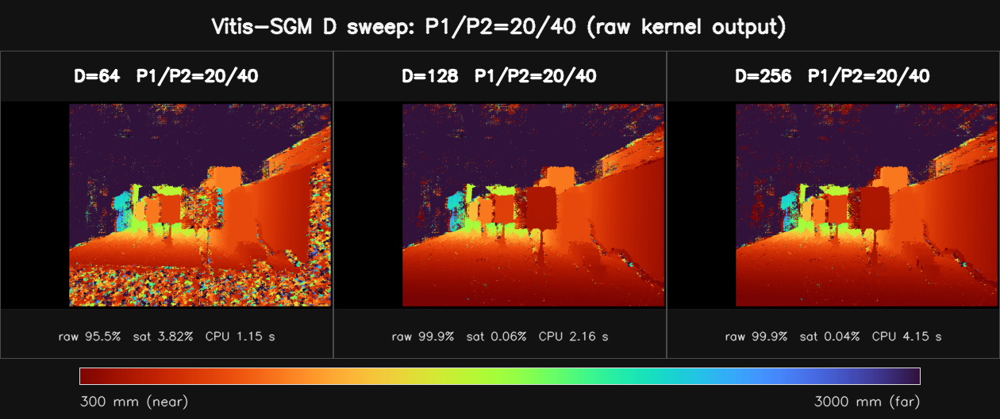
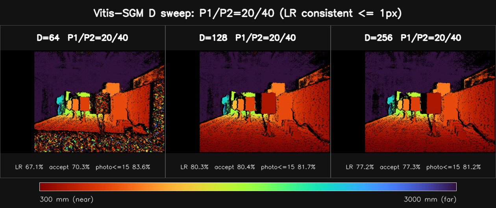
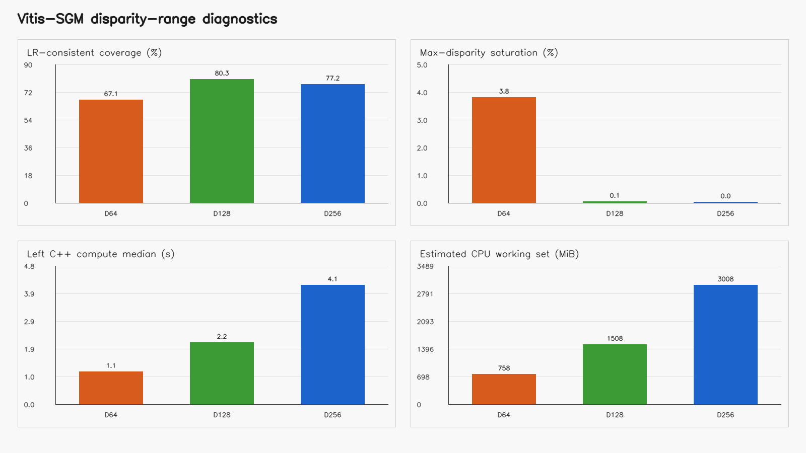
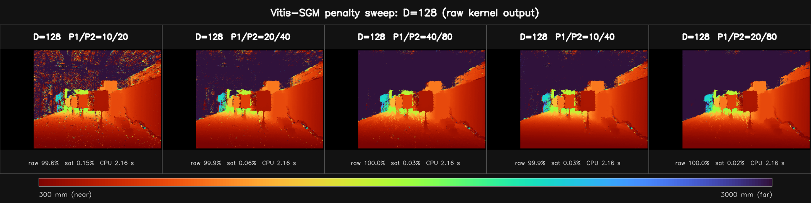
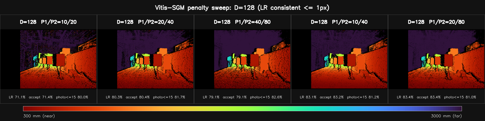
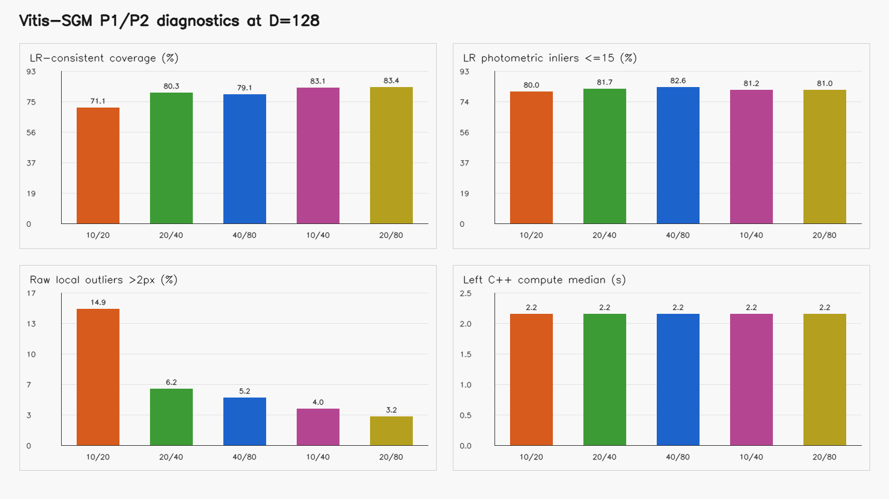
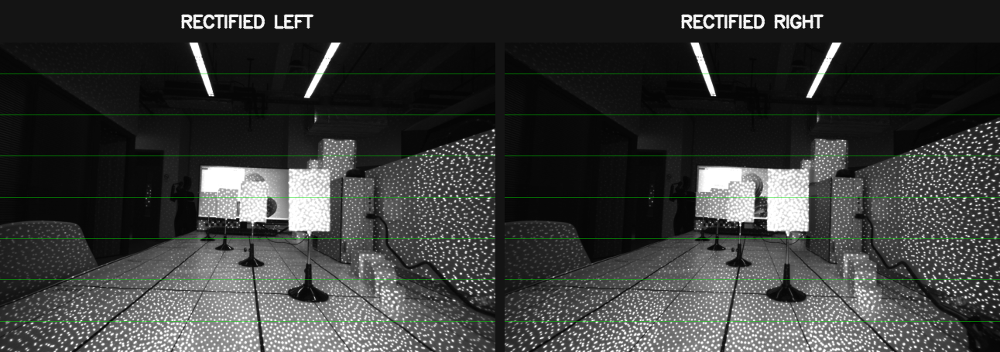

# Gemini335 Vitis-SGBM/SGM：D 与 P1/P2 参数效果对比

## 技术摘要

本报告测试的是仓库 `src/vitis_sgbm_cpu.cpp`：Vitis `sgbm` 测试台的标量 SGM 参考路径，采用 5×5 Census、4 方向路径聚合和整数视差 winner-takes-all；它不是 OpenCV `StereoSGBM`。

实验包含 7 个唯一配置：第一组固定 P1/P2=20/40 比较 D=64,128,256；第二组固定 D=128 比较 P1/P2=10/20,20/40,40/80,10/40,20/80。所有深度图沿用 BM 报告的 300–3000 mm 固定色标和共同 ROI。

在固定 P1/P2 的 D 扫描中，左右一致覆盖最高的是 D=128（80.3%）；在 D=128 的惩罚扫描中最高的是 P1/P2=20/80（83.4%）。由于没有像素级真值，这些是一致性与对应关系诊断，不能解释为绝对深度精度。

### 本次数据的直接结论

- **D=64 对当前近景仍偏小。**其最近搜索边界约 495.3 mm，顶端饱和率 3.82%；D=128 将饱和降到 0.06%，左右一致覆盖由 67.1% 提升到 80.3%。
- **D=256 在这帧上没有带来一致覆盖收益。**D=128 与 D=256 的左右一致覆盖分别是 80.3% 和 77.2%，但左视差中位计算时间从 2.16 s 增至 4.15 s，估算 CPU 工作集从 1507.8 MiB 增至 3007.8 MiB。
- **默认 D=128, P1/P2=20/40 仍是可复现基线。**其左右一致覆盖为 80.3%，LR 光度≤15 占比为 81.7%，中位深度为 761.1 mm。
- **一致性优先时可继续复测 10/40 与 20/80。**本帧中两者的左右一致覆盖分别为 83.1% 和 83.4%，高于默认 80.3%；但 10/40 更允许相邻视差变化，20/80 更强地抑制大跳变，二者可能在斜面和遮挡边界产生不同偏差，无真值时不能仅凭覆盖率定优劣。
- **成比例减弱到 10/20 会明显放大原始局部离群。**原始局部离群率由默认的 6.2% 变为 14.9%；增强到 40/80 后为 5.2%，但更强平滑也需要复查细杆、电缆和深度边界。

## D=128 在当前场景形成最佳范围折中

### 原始 SGM 输出



原始图完整保留 C++ 核的整数视差输出，只把视差 0 画为黑色。该参考实现会对几乎每个像素强制选出一个最小代价视差，因此彩色覆盖完整不等于对应可靠；D=64 的红色近景饱和尤其需要结合下图判断。

### 左右一致性审计后的深度



可信视图只保留左右视差差值≤1 px、且不在 0/D−1 边界的像素。它是脚本额外运行的审计层，不是原 Vitis 核的输出。D=128 相比 D=64 消除了主要近距截断；D=256 增加搜索歧义、时间和软件工作集，在这帧上没有提高 LR 一致覆盖。



四个面板依次比较 LR 一致覆盖、视差顶端饱和、C++ 左视差计算时间和程序估算的 CPU 工作集。后两项只描述当前标量参考程序，不能当作 FPGA latency 或 BRAM/LUT 用量；但 D 近似线性扩大代价体，是后续 HLS 取舍的重要方向。

## P1/P2 改变平滑与边界保留方式

### 原始 SGM 输出



该横向图固定 D=128。10/20、20/40、40/80 用于观察整体惩罚强度；10/40 在固定 P2 时降低相邻视差惩罚，20/80 在固定 P1 时提高大跳变惩罚。这五组不是一个单调标尺，必须按参数作用分别解释。

### 左右一致性审计后的深度



左右一致视图会剔除互相不支持的匹配。较弱的 10/20 在投影散斑和遮挡区出现更多不一致；10/40 与 20/80 在本帧覆盖较高，但一个偏向允许渐变，另一个偏向抑制突变。没有真值时，应在斜面连续性和物体边界上继续做多场景复测。



惩罚参数图展示 LR 一致覆盖、LR 光度一致性、原始局部离群率和 C++ 时间。P1/P2 主要改变输出结构而不改变代价体尺寸，因此这些配置的 CPU 时间和估算工作集接近；未来 FPGA 资源仍需以对应编译期配置的 HLS 综合报告为准。

## 完整指标表

| D | P1/P2 | 最近范围/mm | 原始可用/% | 顶端饱和/% | LR一致覆盖/% | LR接收原始/% | LR光度≤15/% | 原始离群>2px/% | LR深度P10/P50/P90 mm | C++中位时间/s | CPU工作集/MiB | 重复输出一致/% |
|---:|---:|---:|---:|---:|---:|---:|---:|---:|---:|---:|---:|---:|
| 64 | 20/40 | 495.3 | 95.5 | 3.82 | 67.1 | 70.3 | 83.6 | 9.6 | 577.9/3467.2/6241.0 | 1.146 | 757.8 | 100.0000 |
| 128 | 20/40 | 245.7 | 99.9 | 0.06 | 80.3 | 80.4 | 81.7 | 6.2 | 346.7/761.1/6241.0 | 2.160 | 1507.8 | 100.0000 |
| 256 | 20/40 | 122.4 | 99.9 | 0.04 | 77.2 | 77.3 | 81.2 | 8.1 | 342.9/761.1/6241.0 | 4.149 | 3007.8 | 100.0000 |
| 128 | 10/20 | 245.7 | 99.6 | 0.15 | 71.1 | 71.4 | 80.0 | 14.9 | 332.0/663.9/6241.0 | 2.163 | 1507.8 | 100.0000 |
| 128 | 40/80 | 245.7 | 100.0 | 0.03 | 79.1 | 79.1 | 82.6 | 5.2 | 362.9/945.6/6241.0 | 2.163 | 1507.8 | 100.0000 |
| 128 | 10/40 | 245.7 | 99.9 | 0.03 | 83.1 | 83.2 | 81.2 | 4.0 | 342.9/761.1/6241.0 | 2.160 | 1507.8 | 100.0000 |
| 128 | 20/80 | 245.7 | 100.0 | 0.02 | 83.4 | 83.4 | 81.0 | 3.2 | 354.6/800.1/6241.0 | 2.159 | 1507.8 | 100.0000 |

逐配置原始视差、反向审计视差、LR 掩膜、毫米深度、彩色图和运行日志见 [`details/`](details/)。机器可读结果见 [`metrics.csv`](metrics.csv) 与 [`metadata.json`](metadata.json)。

## 数据、标定与指标定义

- 左图：`/home/hcc/Desktop/Public/datasets/gemini335/1280*800分辨率/data/left_IR_IR Left.png`
- 右图：`/home/hcc/Desktop/Public/datasets/gemini335/1280*800分辨率/data/right_IR_IR Right.png`
- 标定来源：`/home/hcc/Desktop/Public/datasets/gemini335/1280*800分辨率/data/Gemini335_CP06563000SS_IR_1280x800_all.yaml`
- 输入尺寸：1280×800
- 校正方式：YAML 标明输入已校正，未二次 remap
- 焦距：619.2955322 px
- 基线：50.3883018 mm
- fx×baseline：31205.2502108 mm·px
- 主点视差偏移：0.0000000 px
- 深度公式：`Z_mm=31205.2502108/(d+0.0000000)`
- 共同 ROI：`x=[266,1270)`, `y=[10,790)`，与 BM 报告一致
- LR 一致容差：≤1 个整数视差像素
- 原始可用：ROI 内 `0 < d < D−1`；D−1 单独记为顶端饱和
- LR 一致覆盖：原始可用且反向视差有效，并满足左右差值容差
- 彩色色标：300–3000 mm；范围外深度仅在图中截到端点颜色，CSV/表格保留实际计算值
- 光度≤15：右图按左视差回投后，灰度绝对误差不超过 15 的比例
- 局部离群>2 px：完整有效 5×5 邻域内，相对局部中位数偏差超过 2 px
- 生成时间：2026-08-03T11:47:55+08:00



绿色水平线用于检查极线方向。Orbbec YAML 标记该输入已经由 SDK 校正，所以本轮不执行二次 remap。

## 方法与可复现性

每个唯一配置均直接调用 `build/vitis_sgbm_cpu`。左视差运行 3 次，报告核心 compute 中位数并逐像素比较重复输出；反向审计再运行一次水平翻转后的 right→left 输入。所有配置的最低重复一致率为 100.0000%，原始图与 C++ 自动生成可视化的最低一致率为 100.0000%。

右向审计构造方式是：水平翻转右图作为第一输入、水平翻转左图作为第二输入，运行同一 C++ 核后再水平翻回。这样程序仍然只执行 `x-d` 搜索，但得到右图坐标上的正视差，可用于 `d_left(x)` 与 `d_right(x-d)` 比较。

本报告与 [StereoBM D/W 对比](../gemini335_1280x800_bm_sweep/STEREOBM_DEPTH_COMPARISON.md) 使用同一图像、标定、深度色标和共同 ROI。不过 BM 是 OpenCV Q4 亚像素参考，当前 SGM 输出整数视差，二者量化精度与无效像素语义不同，不能仅按彩色覆盖直接排名。

本轮非交互复现命令：

```bash
cd "/home/hcc/Desktop/HXB/Vitis_Stereo_CPU_Ver"
python3 scripts/run_vitis_sgbm_parameter_sweep.py \
  --non-interactive --dataset "/home/hcc/Desktop/Public/datasets/gemini335/1280*800分辨率/data" \
  --calibration "/home/hcc/Desktop/Public/datasets/gemini335/1280*800分辨率/data/Gemini335_CP06563000SS_IR_1280x800_all.yaml" \
  --output "/home/hcc/Desktop/HXB/Vitis_Stereo_CPU_Ver/results/gemini335_1280x800_sgbm_sweep" \
  --disparities 64,128,256 \
  --range-p1 20 --range-p2 40 \
  --penalty-disparity 128 \
  --penalty-pairs 10/20,20/40,40/80,10/40,20/80 \
  --depth-min-mm 300 --depth-max-mm 3000 \
  --runs 3 --lr-tolerance-px 1
```

## 限制、稳健性与不能推出的结论

- 本数据只有一对画面且没有真值深度，无法报告 MAE、RMSE、P95 或毫米级绝对精度。
- LR 一致性会排除许多遮挡和错误匹配，但左右双方共同犯错仍可能通过；它不是精度真值。
- 当前输出是整数视差。3 m 附近相邻整数视差对应约 283.7 mm 的深度台阶；这只是量化间隔，不包含匹配和标定误差。
- 原始核没有 uniqueness、置信度、speckle、LR check 或亚像素拟合；报告中的 LR 掩膜是外部审计。
- 4 路径标量 CPU 时间和三份完整代价体的软件工作集不能作为 FPGA 延时或 BRAM/LUT/FF/DSP 用量。
- P1/P2 在本实现中是全图常数，没有按图像梯度自适应；强平滑可能跨越真实深度边界。

## 建议的下一步

先保留 D=128, P1/P2=20/40 作为 Vitis 默认基线，再把本帧 LR 一致覆盖较高的 20/80 纳入候选。下一轮至少加入近距离、弱纹理、细杆/电缆、强遮挡和斜面场景，并固定真实距离标靶。

暂时不上板时，效果验证继续使用 C 仿真；资源与时序必须对与候选完全一致的 D、P1/P2、NUM_DIR、PARALLEL_UNITS 和图像上限做 HLS C 综合，记录 LUT/FF/BRAM/DSP、II、目标时钟和 estimated latency。

## 进一步问题

- 实际最近/最远工作距离和最小目标尺寸是多少？它们决定 D 与整数视差是否足够。
- FPGA 型号、目标频率、Vitis Vision 版本、NUM_DIR 与 PARALLEL_UNITS 计划值是什么？
- 是否能补充已知距离平面或深度真值？有真值后才能判断 10/40 与 20/80 哪个更准确。
